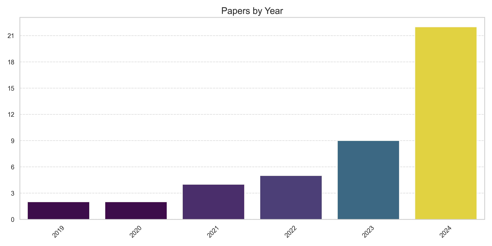
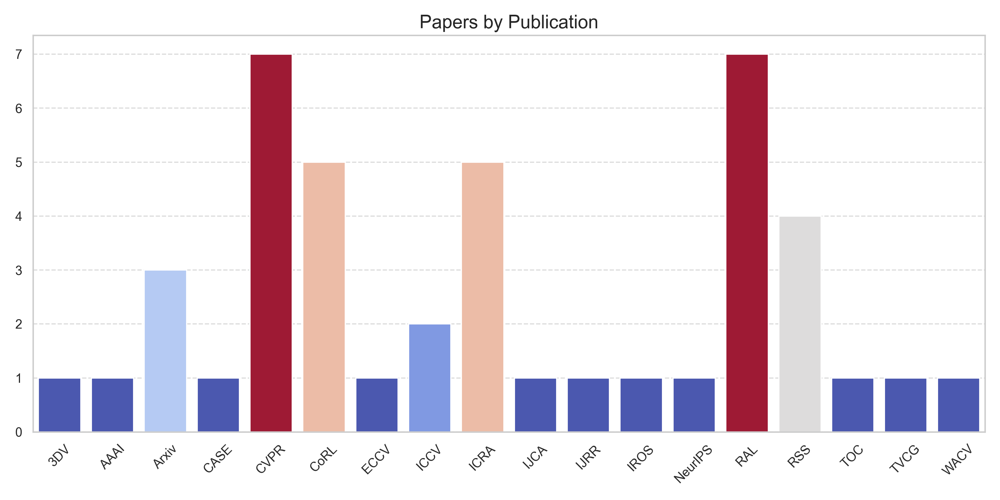

# Awesome 3D Scene Graphs   

## 🏠 About
This is a curated list of papers on 3D Scene Graphs (3DSGs) generation and applications that utilize this particular data structure. These applications include, but are not limited to, autonomous navigation, robotic manipulation, object retrieval, scene understanding, hierarchical path planning, goal-directed navigation, long-term motion prediction, and multi-robot collaboration. 

## 📑 Table of Content
- [Awesome 3D Scene Graphs](#Awesome-3D-Scene-Graphs) 
	- [3D Scene Understanding](#3D-Scene-Understanding) 🏛️
	- [Generation and Mapping](#Generation-and-Mapping) 🗺️
	- [Navigation](#Navigation) 🚀
	- [Planning](#Planning) 🤔
	- [Dataset](#Dataset) 📚
    - [Statistics](#Statistics) 📊 

 The research papers have been categorized into different robotics macro areas by the project maintainers. If you notice any errors or believe that some papers are missing, please feel free to contribute or [contact me](https://dennisrotondi.com/#contact).

## 3D Scene Understanding
| Date    | Publication   | Paper                                                                                                                              | Institute (first)   | Extra                                                                                                     |
|:--------|:--------------|:-----------------------------------------------------------------------------------------------------------------------------------|:--------------------|:----------------------------------------------------------------------------------------------------------|
| 2021-06 | CVPR21        | [Exploiting Edge-Oriented Reasoning for 3D Point-based Scene Graph Analysis](http://arxiv.org/abs/2103.05558v2)                    | USYD                | [project](https://sggpoint.github.io/), [github](https://github.com/chaoyivision/SGGpoint)                |
| 2022-07 | RSS22         | [Extracting Zero-shot Common Sense from Large Language Models for Robot 3D Scene Understanding](http://arxiv.org/abs/2206.04585v2) | MIT                 | -                                                                                                         |
| 2023-05 | ICRA23        | [3D VSG: Long-term Semantic Scene Change Prediction through 3D Variable Scene Graphs](http://arxiv.org/abs/2209.07896v2)           | ETH                 | [project](https://github.com/ethz-asl/3d_vsg)                                                             |
| 2024-02 | Arxiv         | [RoboEXP: Action-Conditioned Scene Graph via Interactive Exploration for Robotic Manipulation](http://arxiv.org/abs/2402.15487v1)  | UIUC                | [project](https://jianghanxiao.github.io/roboexp-web/), [github](https://github.com/Jianghanxiao/RoboEXP) |
| 2024-05 | Arxiv         | [Long-Term Human Trajectory Prediction using 3D Dynamic Scene Graphs](http://arxiv.org/abs/2405.00552v1)                           | MIT                 | [project](https://github.com/MIT-SPARK/LP2)                                                               |
| 2024-09 | Arxiv         | [SpotLight: Robotic Scene Understanding through Interaction and Affordance Detection](http://arxiv.org/abs/2409.11870v1)           | ETH                 | [project](https://timengelbracht.github.io/SpotLight/)                                                    | 

## Generation and Mapping
| Date    | Publication   | Paper                                                                                                                                                                                                                                                                         | Institute (first)   | Extra                                                                                                                                   |
|:--------|:--------------|:------------------------------------------------------------------------------------------------------------------------------------------------------------------------------------------------------------------------------------------------------------------------------|:--------------------|:----------------------------------------------------------------------------------------------------------------------------------------|
| 2019-11 | TOC19         | [3-D Scene Graph: A Sparse and Semantic Representation of Physical Environments for Intelligent Agents](http://arxiv.org/abs/1908.04929v1)                                                                                                                                    | KAIST               | [project](https://github.com/Uehwan/3-D-Scene-Graph)                                                                                    |
| 2020-07 | RSS20         | [3D Dynamic Scene Graphs: Actionable Spatial Perception with Places, Objects, and Humans](http://arxiv.org/abs/2002.06289v2)                                                                                                                                                  | MIT                 | -                                                                                                                                       |
| 2021-06 | CVPR21        | [SceneGraphFusion: Incremental 3D Scene Graph Prediction from RGB-D Sequences](http://arxiv.org/abs/2103.14898v3)                                                                                                                                                             | TUM                 | [project](https://shunchengwu.github.io/SceneGraphFusion), [github](https://github.com/ShunChengWu/SceneGraphFusion?tab=readme-ov-file) |
| 2021-12 | NeurIPS21     | [Knowledge-inspired 3D Scene Graph Prediction in Point Cloud](https://openreview.net/pdf?id=OLyhLK2eQP)                                                                                                                                                                       | BUAA                | -                                                                                                                                       |
| 2022-07 | RSS22         | [Hydra: A Real-time Spatial Perception System for 3D Scene Graph Construction and Optimization](http://arxiv.org/abs/2201.13360v2)                                                                                                                                            | MIT                 | [project](https://github.com/MIT-SPARK/Hydra)                                                                                           |
| 2022-11 | TVCG22        | [Explore Contextual Information for 3D Scene Graph Generation](http://arxiv.org/abs/2210.06240v2)                                                                                                                                                                             | DUT                 | -                                                                                                                                       |
| 2023-06 | CVPR23        | [VL-SAT: Visual-Linguistic Semantics Assisted Training for 3D Semantic Scene Graph Prediction in Point Cloud](http://arxiv.org/abs/2303.14408v1)                                                                                                                              | BUAA                | [project](https://github.com/wz7in/CVPR2023-VLSAT)                                                                                      |
| 2023-06 | CVPR23        | [3D Spatial Multimodal Knowledge Accumulation for Scene Graph Prediction in Point Cloud](https://ieeexplore.ieee.org/document/10204093)                                                                                                                                       | XDU                 | [project](https://cvpr.thecvf.com/virtual/2023/poster/23209)                                                                            |
| 2023-08 | CASE23        | [3D Scene Graph Prediction on Point Clouds Using Knowledge Graphs](http://arxiv.org/abs/2308.06719v1)                                                                                                                                                                         | UCSD                | -                                                                                                                                       |
| 2023-08 | RAL23         | [S-Graphs+: Real-time Localization and Mapping leveraging Hierarchical Representations](http://arxiv.org/abs/2212.11770v3)                                                                                                                                                    | UniLu               | [project](https://snt-arg.github.io/s_graphs_docker/), [github](https://github.com/snt-arg/s_graphs_docker)                             |
| 2023-11 | CoRL23        | [Context-Aware Entity Grounding with Open-Vocabulary 3D Scene Graphs](http://arxiv.org/abs/2309.15940v1)                                                                                                                                                                      | Rutgers             | [project](https://ovsg-l.github.io/), [github](https://github.com/changhaonan/OVSG)                                                     |
| 2024-01 | WACV24        | [SGRec3D: Self-Supervised 3D Scene Graph Learning via Object-Level Scene Reconstruction](http://arxiv.org/abs/2309.15702v2)                                                                                                                                                   | Bosch               | [project](https://kochsebastian.com/sgrec3d)                                                                                            |
| 2024-02 | IJRR24        | [Foundations of Spatial Perception for Robotics: Hierarchical Representations and Real-time Systems](https://arxiv.org/abs/2305.07154)                                                                                                                                        | MIT                 | [project](https://github.com/MIT-SPARK/Hydra)                                                                                           |
| 2024-02 | AAAI24        | [SGFormer: Semantic Graph Transformer for Point Cloud-based 3D Scene Graph Generation](http://arxiv.org/abs/2303.11048v3)                                                                                                                                                     | BJUT                | [project](https://github.com/Andy20178/SGFormer)                                                                                        |
| 2024-03 | RAL24         | [Language-Grounded Dynamic Scene Graphs for Interactive Object Search with Mobile Manipulation](http://arxiv.org/abs/2403.08605v4)                                                                                                                                            | UniFreiburg         | [project](http://moma-llm.cs.uni-freiburg.de/), [github](https://github.com/robot-learning-freiburg/MoMa-LLM)                           |
| 2024-03 | 3DV24         | [Lang3DSG: Language-based contrastive pre-training for 3D Scene Graph prediction](http://arxiv.org/abs/2310.16494v1)                                                                                                                                                          | Bosch               | [project](https://kochsebastian.com/lang3dsg)                                                                                           |
| 2024-04 | Arxiv         | [Clio: Real-time Task-Driven Open-Set 3D Scene Graphs](http://arxiv.org/abs/2404.13696v3)                                                                                                                                                                                     | MIT                 | [project](https://github.com/MIT-SPARK/Clio)                                                                                            |
| 2024-05 | ICRA24        | [ConceptGraphs: Open-Vocabulary 3D Scene Graphs for Perception and Planning](http://arxiv.org/abs/2309.16650v1)                                                                                                                                                               | UToronto            | [project](https://concept-graphs.github.io/), [github](https://github.com/concept-graphs/concept-graphs)                                |
| 2024-06 | CVPR24        | [Open3DSG: Open-Vocabulary 3D Scene Graphs from Point Clouds with Queryable Objects and Open-Set Relationships](http://arxiv.org/abs/2402.12259v2)                                                                                                                            | Bosch               | [project](https://kochsebastian.com/open3dsg), [github](https://github.com/boschresearch/Open3DSG)                                      |
| 2024-06 | RAL24         | [Indoor and Outdoor 3D Scene Graph Generation via Language-Enabled Spatial Ontologies](http://arxiv.org/abs/2312.11713v2)                                                                                                                                                     | MIT                 | -                                                                                                                                       |
| 2024-06 | CVPR24        | [CLIP-Driven Open-Vocabulary 3D Scene Graph Generation via Cross-Modality Contrastive Learning](https://openaccess.thecvf.com/content/CVPR2024/papers/Chen_CLIP-Driven_Open-Vocabulary_3D_Scene_Graph_Generation_via_Cross-Modality_Contrastive_Learning_CVPR_2024_paper.pdf) | ECNU                | -                                                                                                                                       |
| 2024-10 | RAL24         | [OpenGraph: Open-Vocabulary Hierarchical 3D Graph Representation in Large-Scale Outdoor Environments](https://arxiv.org/abs/2403.09412)                                                                                                                                       | BIT                 | [project](https://github.com/BIT-DYN/OpenGraph)                                                                                         | 

## Navigation
| Date    | Publication   | Paper                                                                                                                                                                        | Institute (first)   | Extra                                                                                                                |
|:--------|:--------------|:-----------------------------------------------------------------------------------------------------------------------------------------------------------------------------|:--------------------|:---------------------------------------------------------------------------------------------------------------------|
| 2022-05 | ICRA22        | [Hierarchical Representations and Explicit Memory: Learning Effective Navigation Policies on 3D Scene Graphs using Graph Neural Networks](http://arxiv.org/abs/2108.01176v2) | MIT                 | [project](https://github.com/MIT-TESSE/dsg-rl)                                                                       |
| 2022-10 | IROS22        | [Situational Graphs for Robot Navigation in Structured Indoor Environments](http://arxiv.org/abs/2202.12197v2)                                                               | UniLu               | [project](https://snt-arg.github.io/s_graphs_docker/), [github](https://github.com/snt-arg/lidar_situational_graphs) |
| 2023-11 | RAL23         | [D-Lite: Navigation-Oriented Compression of 3D Scene Graphs for Multi-Robot Collaboration](http://arxiv.org/abs/2209.06111v6)                                                | MIT                 | -                                                                                                                    |
| 2024-05 | ICRA24        | [Collaborative Dynamic 3D Scene Graphs for Automated Driving](http://arxiv.org/abs/2309.06635v3)                                                                             | UniFreiburg         | [project](http://curb.cs.uni-freiburg.de/), [github](https://github.com/robot-learning-freiburg/CURB-SG)             |
| 2024-07 | RSS24         | [Hierarchical Open-Vocabulary 3D Scene Graphs for Language-Grounded Robot Navigation](http://arxiv.org/abs/2403.17846v2)                                                     | UniFreiburg         | [project](https://hovsg.github.io/), [github](https://github.com/hovsg/HOV-SG)                                       |
| 2024-07 | Arxiv         | [Open Scene Graphs for Open World Object-Goal Navigation](http://arxiv.org/abs/2407.02473v1)                                                                                 | NUS                 | [project](https://open-scene-graphs.github.io/)                                                                      |
| 2024-09 | Arxiv         | [Point2Graph: An End-to-end Point Cloud-based 3D Open-Vocabulary Scene Graph for Robot Navigation](http://arxiv.org/abs/2409.10350v1)                                        | UMich               | [project](https://point2graph.github.io/)                                                                            | 

## Planning
| Date    | Publication   | Paper                                                                                                                                | Institute (first)   | Extra                                                                                                                                        |
|:--------|:--------------|:-------------------------------------------------------------------------------------------------------------------------------------|:--------------------|:---------------------------------------------------------------------------------------------------------------------------------------------|
| 2021-11 | CoRL21        | [TASKOGRAPHY: Evaluating robot task planning over large 3D scene graphs](http://arxiv.org/abs/2207.05006v1)                          | UToronto            | [project](https://taskography.github.io/), [github](https://github.com/taskography/taskography)                                              |
| 2023-11 | CoRL23        | [SayPlan: Grounding Large Language Models using 3D Scene Graphs for Scalable Robot Task Planning](http://arxiv.org/abs/2307.06135v2) | QUT                 | [project](https://sayplan.github.io/)                                                                                                        |
| 2024-05 | ICRA24        | [Optimal Scene Graph Planning with Large Language Model Guidance](http://arxiv.org/abs/2309.09182v2)                                 | UCSD                | [project](https://existentialrobotics.org/pages/llm-planning), [github](https://github.com/ExistentialRobotics/LLM-Scene-Graph-LTL-Planning) | 

## Dataset
| Date    | Publication   | Paper                                                                                                        | Institute (first)   | Extra                                                                                               |
|:--------|:--------------|:-------------------------------------------------------------------------------------------------------------|:--------------------|:----------------------------------------------------------------------------------------------------|
| 2019-10 | ICCV19        | [3D Scene Graph: A Structure for Unified Semantics, 3D Space, and Camera](http://arxiv.org/abs/1910.02527v1) | Stanford            | [project](https://3dscenegraph.stanford.edu/), [github](https://github.com/StanfordVL/3DSceneGraph) |
| 2020-06 | CVPR20        | [Learning 3D Semantic Scene Graphs from 3D Indoor Reconstructions](http://arxiv.org/abs/2004.03967v1)        | TUM                 | [project](https://3dssg.github.io/)                                                                 | 

## Statistics

## Acknowledgement
This project was inspired by [Awesome-LLM-3D](https://github.com/ActiveVisionLab/Awesome-LLM-3D). You can use [awesome-scene-graph](https://github.com/mqjyl/awesome-scene-graph) for 2D resources. 
