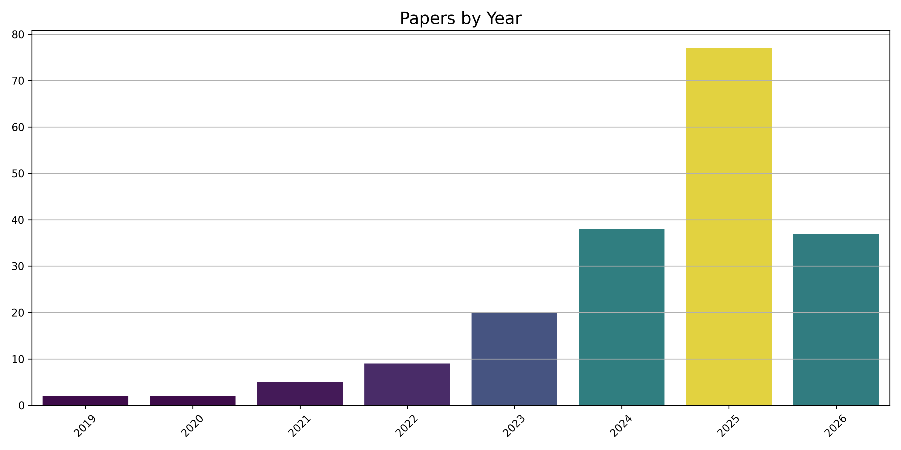
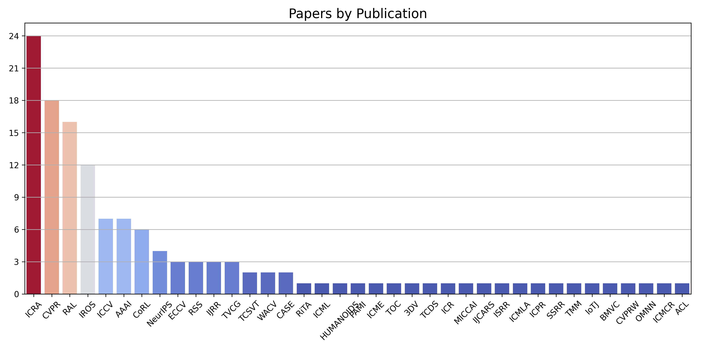

# Awesome 3D Scene Graphs   

A curated list of papers on 3D Scene Graphs (3DSGs), covering generation and applications such as autonomous navigation, robotic manipulation, scene understanding, path planning, and multi-robot collaboration.

This repository accompanies the survey paper **["3D Scene Graphs: Open Challenges and Future Directions"](https://arxiv.org/abs/2606.19383)**, a comprehensive review of the 3DSG literature. It also contains the source code for the companion website at [3dscenegraphs.com](https://3dscenegraphs.com). The paper database lives in the [`papers/`](papers) folder (one JSON file per paper) and drives both this README and the website. To add or edit a paper, open a PR adding or modifying a file in [`papers/`](papers) (see [contributing.md](contributing.md) for the field format).

## 📑 Contents
- [3D Scene Understanding](#3d-scene-understanding) 🏛️
- [Generation and Mapping](#generation-and-mapping) 🗺️
- [Navigation](#navigation) 🚀
- [Planning](#planning) 🤔
- [Dataset](#dataset) 📚
- [Other](#other) 📌
- [Statistics](#statistics) 📊

## 3D Scene Understanding
| Date    | Publication   | Paper                                                                                                                                                              | Institute (first)             | Extra                                                                                                                 |
|:--------|:--------------|:-------------------------------------------------------------------------------------------------------------------------------------------------------------------|:------------------------------|:----------------------------------------------------------------------------------------------------------------------|
| 2022-03 | MICCAI22      | [4D-OR: Semantic Scene Graphs for OR Domain Modeling](https://arxiv.org/abs/2203.11937)                                                                            | TUM                           | [project](https://conferences.miccai.org/2022/papers/003-Paper1512.html), [github](https://github.com/egeozsoy/4D-OR) |
| 2022-06 | arXiv22       | [Extracting Zero-shot Common Sense from Large Language Models for Robot 3D Scene Understanding](https://arxiv.org/abs/2206.04585)                                  | MIT                           | -                                                                                                                     |
| 2022-09 | ICRA23        | [3D VSG: Long-term Semantic Scene Change Prediction through 3D Variable Scene Graphs](https://arxiv.org/abs/2209.07896)                                            | ETH                           | [github](https://github.com/ethz-asl/3d_vsg)                                                                          |
| 2023-02 | RAL23         | [Towards Long-Term Retrieval-Based Visual Localization in Indoor Environments with Changes](https://ieeexplore.ieee.org/document/10038537)                         | TUM                           | -                                                                                                                     |
| 2023-04 | ICCV23        | [SGAligner: 3D Scene Alignment with Scene Graphs](https://arxiv.org/abs/2304.14880)                                                                                | ETH                           | [project](https://sayands.github.io/sgaligner/), [github](https://github.com/sayands/sgaligner)                       |
| 2023-09 | ICRA24        | [ConceptGraphs: Open-Vocabulary 3D Scene Graphs for Perception and Planning](https://arxiv.org/abs/2309.16650)                                                     | UToronto                      | [project](https://concept-graphs.github.io/), [github](https://github.com/concept-graphs/concept-graphs)              |
| 2023-09 | CoRL23        | [Context-Aware Entity Grounding with Open-Vocabulary 3D Scene Graphs](https://arxiv.org/abs/2309.15940)                                                            | Rutgers                       | [project](https://ovsg-l.github.io/), [github](https://github.com/changhaonan/OVSG)                                   |
| 2023-12 | RAL24         | [Indoor and Outdoor 3D Scene Graph Generation via Language-Enabled Spatial Ontologies](https://arxiv.org/abs/2312.11713)                                           | MIT                           | -                                                                                                                     |
| 2024-01 | IJCARS24      | [Holistic OR domain modeling: a semantic scene graph approach](https://link.springer.com/article/10.1007/s11548-023-03022-w)                                       | TUM                           | [github](https://github.com/egeozsoy/4D-OR)                                                                           |
| 2024-02 | ICRA24        | [Belief Scene Graphs: Expanding Partial Scenes with Objects through Computation of Expectation](https://arxiv.org/abs/2402.03840)                                  | LTU                           | -                                                                                                                     |
| 2024-03 | RAL24         | [OpenGraph: Open-Vocabulary Hierarchical 3D Graph Representation in Large-Scale Outdoor Environments](https://arxiv.org/abs/2403.09412)                            | BIT                           | [github](https://github.com/BIT-DYN/OpenGraph)                                                                        |
| 2024-03 | ECCV24        | [SceneGraphLoc: Cross-Modal Coarse Visual Localization on 3D Scene Graphs](https://arxiv.org/abs/2404.00469)                                                       | ETH                           | [project](https://scenegraphloc.github.io/), [github](https://github.com/y9miao/VLSG)                                 |
| 2024-03 | RSS24         | [Hierarchical Open-Vocabulary 3D Scene Graphs for Language-Grounded Robot Navigation](https://arxiv.org/abs/2403.17846)                                            | UniFreiburg                   | [project](https://hovsg.github.io/), [github](https://github.com/hovsg/HOV-SG)                                        |
| 2024-04 | ECCV24        | [“Where am I?” Scene Retrieval with Language](https://arxiv.org/abs/2404.14565)                                                                                    | ETH                           | -                                                                                                                     |
| 2024-04 | RAL24         | [Clio: Real-time Task-Driven Open-Set 3D Scene Graphs](https://arxiv.org/abs/2404.13696)                                                                           | MIT                           | [github](https://github.com/MIT-SPARK/Clio)                                                                           |
| 2024-05 | RAL24         | [Long-Term Human Trajectory Prediction using 3D Dynamic Scene Graphs](https://arxiv.org/abs/2405.00552)                                                            | MIT                           | [github](https://github.com/MIT-SPARK/LP2)                                                                            |
| 2024-06 | NeurIPS24     | [SpatialRGPT: Grounded Spatial Reasoning in Vision-Language Models](https://arxiv.org/abs/2406.01584)                                                              | UCSD                          | [project](https://www.anjiecheng.me/SpatialRGPT), [github](https://github.com/AnjieCheng/SpatialRGPT)                 |
| 2024-06 | ICRA25        | [Beyond Bare Queries: Open-Vocabulary Object Grounding with 3D Scene Graph](https://arxiv.org/abs/2406.07113)                                                      | MIPT                          | [project](https://linukc.github.io/BeyondBareQueries/), [github](https://github.com/linukc/BeyondBareQueries)         |
| 2024-07 | RAL24         | [ViewInfer3D: 3D Visual Grounding Based on Embodied Viewpoint Inference](https://ieeexplore.ieee.org/document/10592798)                                            | BUPT                          | -                                                                                                                     |
| 2024-09 | arXiv25       | [Embodied-RAG: General Non-parametric Embodied Memory for Retrieval and Generation](https://arxiv.org/abs/2409.18313)                                              | CMU                           | [project](https://quanting-xie.github.io/Embodied-RAG-web/)                                                           |
| 2024-09 | HUMANOIDS25   | [SpotLight: Robotic Scene Understanding through Interaction and Affordance Detection](https://arxiv.org/abs/2409.11870)                                            | ETH                           | [project](https://timengelbracht.github.io/SpotLight/), [github](https://github.com/timengelbracht/Spot-Light)        |
| 2024-11 | ICCV25        | [Open-Vocabulary Octree-Graph for 3D Scene Understanding](https://arxiv.org/abs/2411.16253)                                                                        | ShanghaiAI                    | -                                                                                                                     |
| 2024-11 | RAL25         | [Lost & Found: Tracking Changes from Egocentric Observations in 3D Dynamic Scene Graphs](https://arxiv.org/abs/2411.19162)                                         | ETH                           | [project](https://behretj.github.io/LostAndFound/), [github](https://github.com/behretj/LostFound)                    |
| 2024-12 | AAAI25        | [TB-HSU: Hierarchical 3D Scene Understanding with Contextual Affordances](https://arxiv.org/abs/2412.05596)                                                        | USYD                          | [github](https://github.com/WentingXu3o3/TB-HSU)                                                                      |
| 2024-12 | arXiv24       | [3DGraphLLM: Combining Semantic Graphs and Large Language Models for 3D Scene Understanding](https://arxiv.org/abs/2412.18450)                                     | AIRI                          | [github](https://github.com/CognitiveAISystems/3DGraphLLM)                                                            |
| 2024-12 | CoRL25        | [GraphEQA: Using 3D Semantic Scene Graphs for Real-time Embodied Question Answering](https://www.arxiv.org/abs/2412.14480)                                         | CMU                           | [project](https://saumyasaxena.github.io/grapheqa/)                                                                   |
| 2024-12 | CVPR25        | [Relationfield: Relate anything in radiance fields](https://arxiv.org/abs/2412.13652)                                                                              | Bosch                         | [project](https://relationfield.github.io/), [github](https://github.com/boschresearch/relationfield)                 |
| 2025-02 | IROS25        | [DynamicGSG: Dynamic 3D Gaussian Scene Graphs for Environment Adaptation](https://arxiv.org/abs/2502.15309)                                                        | BIT                           | [github](https://github.com/GeLuzhou/Dynamic-GSG)                                                                     |
| 2025-03 | IROS25        | [REACT: Real-time Efficient Attribute Clustering and Transfer for Updatable 3D Scene Graph](https://arxiv.org/abs/2503.03412)                                      | AALTO                         | -                                                                                                                     |
| 2025-03 | IROS25        | [GaussianGraph: 3D Gaussian-based Scene Graph Generation for Open-world Scene Understanding](https://arxiv.org/abs/2503.04034)                                     | BIT                           | [project](https://wangxihan-bit.github.io/GaussianGraph/), [github](https://github.com/WangXihan-bit/GaussianGraph/)  |
| 2025-03 | CVPR25        | [Open-Vocabulary Functional 3D Scene Graphs for Real-World Indoor Spaces](https://arxiv.org/abs/2503.19199)                                                        | ETH                           | [project](https://openfungraph.github.io/), [github](https://github.com/ZhangCYG/OpenFunGraph)                        |
| 2025-03 | IROS25        | [FunGraph: Functionality Aware 3D Scene Graphs for Language-Prompted Scene Interaction](https://arxiv.org/abs/2503.07909)                                          | UniStuttgart                  | [project](https://fungraph.github.io/), [github](https://github.com/DennisRotondi/FunGraph)                           |
| 2025-03 | arXiv25       | [Exploring 3D Activity Reasoning and Planning: From Implicit Human Intentions to Route-Aware Planning](https://arxiv.org/abs/2503.12974)                           | NTU                           | -                                                                                                                     |
| 2025-03 | CVPR25        | [MM-OR: A Large Multimodal Operating Room Dataset for Semantic Understanding of High-Intensity Surgical Environments](https://arxiv.org/abs/2503.02579)            | TUM                           | [project](https://egeozsoy.github.io/MM-OR/), [github](https://github.com/egeozsoy/MM-OR)                             |
| 2025-03 | arXiv25       | [vS-Graphs: Integrating Visual SLAM and Situational Graphs through Multi-level Scene Understanding](https://www.arxiv.org/abs/2503.01783)                          | UniLu                         | [project](https://snt-arg.github.io/vsgraphs-results/)                                                                |
| 2025-03 | ICRA25        | [IRef-VLA: A Benchmark for Interactive Referential Grounding with Imperfect Language in 3D Scenes](https://arxiv.org/abs/2503.17406)                               | CMU                           | [github](https://github.com/HaochenZ11/IRef-VLA)                                                                      |
| 2025-04 | TCSVT25       | [Visual Environment-Interactive Planning for Embodied Complex-Question Answering](https://arxiv.org/abs/2504.00775)                                                | XDU                           | -                                                                                                                     |
| 2025-05 | NeurIPS25     | [EgoExOR: An Ego-Exo-Centric Operating Room Dataset for Surgical Activity Understanding](https://arxiv.org/abs/2505.24287)                                         | TUM                           | [project](https://huggingface.co/datasets/ardamamur/EgoExOR), [github](https://github.com/ardamamur/EgoExOR)          |
| 2025-05 | ICRA25        | [Estimating Commonsense Scene Composition on Belief Scene Graphs](https://arxiv.org/abs/2505.02405)                                                                | LTU                           | -                                                                                                                     |
| 2025-06 | arXiv25       | [FreeQ-Graph: Free-form Querying with Semantic Consistent Scene Graph for 3D Scene Understanding](https://arxiv.org/abs/2506.13629)                                | ZJU                           | -                                                                                                                     |
| 2025-07 | ICCV25        | [FROSS: Faster-than-Real-Time Online 3D Semantic Scene Graph Generation from RGB-D Images](https://arxiv.org/abs/2507.19993)                                       | NTHU                          | [github](https://github.com/Howardkhh/FROSS)                                                                          |
| 2025-07 | arXiv25       | [Open-Vocabulary Indoor Object Grounding with 3D Hierarchical Scene Graph](https://arxiv.org/abs/2507.12123)                                                       | MIPT                          | [github](https://github.com/linukc/OVIGo-3DHSG)                                                                       |
| 2025-09 | arXiv25       | [SGAligner++: Cross-Modal Language-Aided 3D Scene Graph Alignment](https://arxiv.org/abs/2509.20401)                                                               | TUM                           | [project](https://singhbino3d.github.io/sgpp/)                                                                        |
| 2025-09 | arXiv25       | [Queryable 3D Scene Representation: A Multi-Modal Framework for Semantic Reasoning and Robotic Task Planning](https://arxiv.org/abs/2509.20077)                    | CSIRO                         | -                                                                                                                     |
| 2025-09 | IROS26        | [Social 3D Scene Graphs: Modeling Human Actions and Relations for Interactive Service Robots](https://arxiv.org/abs/2509.24966)                                    | KTH                           | -                                                                                                                     |
| 2025-10 | RAL25         | [Event-Grounding Graph: Unified Spatio-Temporal Scene Graph from Robotic Observations](https://arxiv.org/abs/2510.18697)                                           | AALTO                         | [github](https://github.com/aalto-intelligent-robotics/EGG)                                                           |
| 2025-10 | arXiv25       | [Structured Interfaces for Automated Reasoning with 3D Scene Graphs](https://arxiv.org/abs/2510.16643)                                                             | MIT                           | -                                                                                                                     |
| 2025-10 | ICRA26        | [KeySG: Hierarchical Keyframe-Based 3D Scene Graphs](https://arxiv.org/abs/2510.01049)                                                                             | UniStuttgart                  | [project](https://keysg-lab.github.io/)                                                                               |
| 2025-10 | arXiv25       | [ZING-3D: Zero-shot Incremental 3D Scene Graphs via Vision-Language Models](https://arxiv.org/abs/2510.21069)                                                      | BITS Pilani                   | -                                                                                                                     |
| 2025-10 | TVCG25        | [SGSG: Stroke-Guided Scene Graph Generation](https://ieeexplore.ieee.org/document/11192081)                                                                        | BUAA                          | [github](https://github.com/Sycamore-Ma/SGSG-runtime)                                                                 |
| 2025-11 | AAAI26        | [Open-World 3D Scene Graph Generation for Retrieval-Augmented Reasoning](https://arxiv.org/abs/2511.05894)                                                         | LNUT                          | -                                                                                                                     |
| 2025-11 | AAAI26        | [Sparse3DPR: Training-Free 3D Hierarchical Scene Parsing and Task-Adaptive Subgraph Reasoning from Sparse RGB Views](https://arxiv.org/abs/2511.07813)             | CAS                           | -                                                                                                                     |
| 2025-11 | CVPR26        | [MSGNav: Unleashing the Power of Multi-modal 3D Scene Graph for Zero-Shot Embodied Navigation](https://arxiv.org/abs/2511.10376)                                   | XMU                           | [github](https://github.com/ylwhxht/MSGNav)                                                                           |
| 2025-11 | CVPR26        | [Describe Anything Anywhere At Any Moment](https://arxiv.org/abs/2512.00565)                                                                                       | MIT                           | [project](https://nicolasgorlo.com/DAAAM_25/), [github](https://github.com/MIT-SPARK/DAAAM)                           |
| 2025-12 | arXiv25       | [View-on-Graph: Zero-Shot 3D Visual Grounding via Vision-Language Reasoning on Scene Graphs](https://arxiv.org/abs/2512.09215)                                     | DUT                           | -                                                                                                                     |
| 2025-12 | arXiv25       | [Vision to Geometry: 3D Spatial Memory for Sequential Embodied MLLM Reasoning and Exploration](https://arxiv.org/abs/2512.02458)                                   | MSU                           | -                                                                                                                     |
| 2025-12 | arXiv25       | [ArtiSG: Functional 3D Scene Graph Construction via Human-demonstrated Articulated Objects Manipulation](https://arxiv.org/abs/2512.24845)                         | Tsinghua                      | -                                                                                                                     |
| 2026-01 | WACV26        | [VIZOR: Viewpoint-Invariant Zero-Shot Scene Graph Generation for 3D Scene Reasoning](https://arxiv.org/abs/2602.00637)                                             | IIIT-H                        | [project](https://vivekmadhavaram.github.io/vizor/)                                                                   |
| 2026-02 | arXiv26       | [Articulated 3D Scene Graphs for Open-World Mobile Manipulation](https://arxiv.org/abs/2602.16356)                                                                 | UniFreiburg                   | -                                                                                                                     |
| 2026-02 | arXiv26       | [INHerit-SG: Incremental Hierarchical Semantic Scene Graphs with RAG-Style Retrieval](https://arxiv.org/abs/2602.12971)                                            | NJU                           | [project](https://fangyuktung.github.io/INHeritSG.github.io/)                                                         |
| 2026-02 | arXiv26       | [Relational Scene Graphs for Object Grounding of Natural Language Commands](https://arxiv.org/abs/2602.04635)                                                      | AALTO                         | -                                                                                                                     |
| 2026-02 | ICRA26        | [Relationship-Aware Hierarchical 3D Scene Graph for Task Reasoning](https://arxiv.org/abs/2602.02456)                                                              | NTNU                          | -                                                                                                                     |
| 2026-02 | arXiv26       | [A Scene Graph Backed Approach to Open Set Semantic Mapping](https://arxiv.org/abs/2602.03781)                                                                     | DFKI                          | -                                                                                                                     |
| 2026-03 | arXiv26       | [SGR3 Model: Scene Graph Retrieval-Reasoning Model in 3D](https://arxiv.org/abs/2603.04614)                                                                        | KIT                           | -                                                                                                                     |
| 2026-03 | arXiv26       | [OGScene3D: Incremental Open-Vocabulary 3D Gaussian Scene Graph Mapping for Scene Understanding](https://arxiv.org/abs/2603.16301)                                 | Shanghai Jiao Tong University | [github](https://github.com/IRMVLab/OGScene3D)                                                                        |
| 2026-03 | arXiv26       | [ToLL: Topological Layout Learning with Asymmetric Cross-View Structural Distillation for 3D Scene Graph Generation Pretraining](https://arxiv.org/abs/2603.28178) | UESTC                         | [github](https://github.com/UESTC-nnLab/ToLL-SGG)                                                                     |
| 2026-04 | CVPR26        | [FunFact: Building Probabilistic Functional 3D Scene Graphs via Factor-Graph Reasoning](https://arxiv.org/abs/2604.03696)                                          | ETH                           | [project](https://funfact-scenegraph.github.io/)                                                                      |
| 2026-04 | ACL26         | [CAPruner: Conceptual-Adjacent Scene Graph Pruner for Enhancing 3D Spatial Reasoning of Large Language Models](https://arxiv.org/abs/2606.07529)                   | SUSTech                       | [github](https://github.com/fz-zsl/CAPruner)                                                                          |
| 2026-05 | arXiv26       | [SceneGraphGrounder: Zero-Shot 3D Visual Grounding via Structured Scene Graph Matching](https://arxiv.org/abs/2605.21788)                                          | CU Boulder                    | -                                                                                                                     |
| 2026-05 | arXiv26       | [Hierarchical and Holistic Open-Vocabulary Functional 3D Scene Graphs for Indoor Spaces](https://arxiv.org/abs/2605.15753)                                         | THU                           | -                                                                                                                     |
| 2026-05 | arXiv26       | [FOUND-IT: Foundation-model-first Task-driven 3D Scene Graphs with Granularity on Demand](https://arxiv.org/abs/2605.25371)                                        | MIT                           | -                                                                                                                     |
| 2026-05 | arXiv26       | [DGSG-Mind: Dynamic 3D Gaussian Scene Graphs for Long-Term Scene Understanding and Grounding](https://arxiv.org/abs/2605.29879)                                    | BIT                           | [project](https://icr-lab.github.io/DGSG-Mind)                                                                        |
| 2026-05 | ICML26        | [PSG-Nav: Probabilistic Scene Graph Navigation via Multiverse Decision Making](https://arxiv.org/abs/2606.01313)                                                   | HKUST                         | [project](https://psg-nav.github.io/)                                                                                 |
| 2026-05 | arXiv26       | [OpenSGA: Efficient 3D Scene Graph Alignment in the Open World](https://arxiv.org/abs/2605.10484)                                                                  | TU Delft                      | [project](https://autonomousrobots.nl/paper_websites/opensga)                                                         |
| 2026-06 | ECCV26        | [OP3DSG: Open-Vocabulary Part-Aware 3D Scene Graph Generation for Real-World Environments](https://arxiv.org/abs/2606.29786)                                       | GIST                          | [project](https://k2room.github.io/OP3DSG/)                                                                           |
| 2026-06 | ICRA26        | [T-FunS3D: Task-Driven Hierarchical Open-Vocabulary 3D Functionality Segmentation](https://arxiv.org/abs/2606.05975)                                               | TU Delft                      | [project](https://t-funs3d.github.io)                                                                                 |
| 2026-06 | ECCV26        | [Graph-GSReg: Leveraging 3D Scene Graphs for Gaussian Splatting Registration](https://arxiv.org/abs/2606.29782)                                                    | Yonsei                        | [project](https://lee-jaewon.github.io/Graph-GSReg/)                                                                  |
| 2026-06 | arXiv26       | [PhysGraph: A Physics-aware 3D Scene Graph for Perception and Reasoning](https://arxiv.org/abs/2606.08655)                                                         | DUKE                          | [project](https://phys-graph.github.io/)                                                                              |
| 2026-06 | arXiv26       | [Remember with Confidence: Uncertainty Quantification for Spatio-temporal Memory with Probabilistic Guarantees](https://arxiv.org/abs/2606.08277)                  | MIT                           | -                                                                                                                     |
| 2026-06 | arXiv26       | [Not All Relations Rotate Alike: Transformation-Aware Decoupling for Viewpoint-Robust 3D Scene Graph Generation](https://arxiv.org/abs/2606.27412)                 | NWPU                          | [project](https://tad-predicate.github.io/), [github](https://github.com/Gineven/TAD)                                 |
| 2026-06 | arXiv26       | [Worth Remembering: Surprise-Gated Robot Episodic Memory](https://arxiv.org/abs/2606.03787)                                                                        | MIT                           | -                                                                                                                     | 

## Generation and Mapping
| Date    | Publication   | Paper                                                                                                                                                                                                                                                                         | Institute (first)             | Extra                                                                                                                                     |
|:--------|:--------------|:------------------------------------------------------------------------------------------------------------------------------------------------------------------------------------------------------------------------------------------------------------------------------|:------------------------------|:------------------------------------------------------------------------------------------------------------------------------------------|
| 2019-08 | TOC19         | [3-D Scene Graph: A Sparse and Semantic Representation of Physical Environments for Intelligent Agents](https://arxiv.org/abs/1908.04929)                                                                                                                                     | KAIST                         | [github](https://github.com/Uehwan/3-D-Scene-Graph)                                                                                       |
| 2019-10 | ICCV19        | [3D Scene Graph: A Structure for Unified Semantics, 3D Space, and Camera](https://arxiv.org/abs/1910.02527)                                                                                                                                                                   | Stanford                      | [project](https://3dscenegraph.stanford.edu/), [github](https://github.com/StanfordVL/3DSceneGraph)                                       |
| 2020-02 | RSS20         | [3D Dynamic Scene Graphs: Actionable Spatial Perception with Places, Objects, and Humans](https://arxiv.org/abs/2002.06289)                                                                                                                                                   | MIT                           | -                                                                                                                                         |
| 2020-04 | CVPR20        | [Learning 3D Semantic Scene Graphs from 3D Indoor Reconstructions](https://arxiv.org/abs/2004.03967)                                                                                                                                                                          | TUM                           | [project](https://3dssg.github.io/), [github](https://github.com/3DSSG/3DSSG.github.io)                                                   |
| 2021-01 | IJRR21        | [Kimera: from SLAM to Spatial Perception with 3D Dynamic Scene Graphs](https://arxiv.org/abs/2101.06894)                                                                                                                                                                      | MIT                           | [github](https://github.com/MIT-SPARK/Kimera)                                                                                             |
| 2021-03 | CVPR21        | [SceneGraphFusion: Incremental 3D Scene Graph Prediction from RGB-D Sequences](https://arxiv.org/abs/2103.14898)                                                                                                                                                              | TUM                           | [project](https://shunchengwu.github.io/SceneGraphFusion), [github](https://github.com/ShunChengWu/SceneGraphFusion?tab=readme-ov-file)   |
| 2021-03 | CVPR21        | [Exploiting Edge-Oriented Reasoning for 3D Point-based Scene Graph Analysis](https://arxiv.org/abs/2103.05558)                                                                                                                                                                | USYD                          | [project](https://sggpoint.github.io/), [github](https://github.com/chaoyivision/SGGpoint)                                                |
| 2021-08 | ICRA22        | [Hierarchical Representations and Explicit Memory: Learning Effective Navigation Policies on 3D Scene Graphs using Graph Neural Networks](https://arxiv.org/abs/2108.01176)                                                                                                   | MIT                           | [github](https://github.com/MIT-TESSE/dsg-rl)                                                                                             |
| 2021-12 | NeurIPS21     | [Knowledge-inspired 3D Scene Graph Prediction in Point Cloud](https://proceedings.neurips.cc/paper_files/paper/2021/hash/9a555403384fc12f931656dea910e334-Abstract.html)                                                                                                      | BUAA                          | -                                                                                                                                         |
| 2022-01 | RSS22         | [Hydra: A Real-time Spatial Perception System for 3D Scene Graph Construction and Optimization](https://arxiv.org/abs/2201.13360)                                                                                                                                             | MIT                           | [github](https://github.com/MIT-SPARK/Hydra)                                                                                              |
| 2022-02 | RAL22         | [Situational Graphs for Robot Navigation in Structured Indoor Environments](https://arxiv.org/abs/2202.12197)                                                                                                                                                                 | UniLu                         | [project](https://snt-arg.github.io/s_graphs_docker/), [github](https://github.com/snt-arg/lidar_situational_graphs)                      |
| 2022-03 | MICCAI22      | [4D-OR: Semantic Scene Graphs for OR Domain Modeling](https://arxiv.org/abs/2203.11937)                                                                                                                                                                                       | TUM                           | [project](https://conferences.miccai.org/2022/papers/003-Paper1512.html), [github](https://github.com/egeozsoy/4D-OR)                     |
| 2022-09 | RAL23         | [D-Lite: Navigation-Oriented Compression of 3D Scene Graphs for Multi-Robot Collaboration](https://arxiv.org/abs/2209.06111)                                                                                                                                                  | MIT                           | -                                                                                                                                         |
| 2022-09 | ICRA23        | [3D VSG: Long-term Semantic Scene Change Prediction through 3D Variable Scene Graphs](https://arxiv.org/abs/2209.07896)                                                                                                                                                       | ETH                           | [github](https://github.com/ethz-asl/3d_vsg)                                                                                              |
| 2022-10 | TVCG22        | [Explore Contextual Information for 3D Scene Graph Generation](https://arxiv.org/abs/2210.06240)                                                                                                                                                                              | DUT                           | -                                                                                                                                         |
| 2022-12 | RAL23         | [S-Graphs+: Real-time Localization and Mapping leveraging Hierarchical Representations](https://arxiv.org/abs/2212.11770)                                                                                                                                                     | UniLu                         | [project](https://snt-arg.github.io/s_graphs_docker/#v2), [github](https://github.com/snt-arg/s_graphs_docker)                            |
| 2023-02 | RAL23         | [Towards Long-Term Retrieval-Based Visual Localization in Indoor Environments with Changes](https://ieeexplore.ieee.org/document/10038537)                                                                                                                                    | TUM                           | -                                                                                                                                         |
| 2023-03 | AAAI24        | [SGFormer: Semantic Graph Transformer for Point Cloud-based 3D Scene Graph Generation](https://arxiv.org/abs/2303.11048)                                                                                                                                                      | BJUT                          | [github](https://github.com/Andy20178/SGFormer)                                                                                           |
| 2023-03 | CVPR23        | [VL-SAT: Visual-Linguistic Semantics Assisted Training for 3D Semantic Scene Graph Prediction in Point Cloud](https://arxiv.org/abs/2303.14408)                                                                                                                               | BUAA                          | [github](https://github.com/wz7in/CVPR2023-VLSAT)                                                                                         |
| 2023-04 | ICCV23        | [SGAligner: 3D Scene Alignment with Scene Graphs](https://arxiv.org/abs/2304.14880)                                                                                                                                                                                           | ETH                           | [project](https://sayands.github.io/sgaligner/), [github](https://github.com/sayands/sgaligner)                                           |
| 2023-04 | IROS23        | [Hydra-Multi: Collaborative Online Construction of 3D Scene Graphs with Multi-Robot Teams](https://arxiv.org/abs/2304.13487)                                                                                                                                                  | MIT                           | -                                                                                                                                         |
| 2023-05 | CVPR23        | [Incremental 3D Semantic Scene Graph Prediction from RGB Sequences](https://arxiv.org/abs/2305.02743)                                                                                                                                                                         | TUM                           | -                                                                                                                                         |
| 2023-05 | IJRR24        | [Foundations of Spatial Perception for Robotics: Hierarchical Representations and Real-time Systems](https://arxiv.org/abs/2305.07154)                                                                                                                                        | MIT                           | [project](https://github.com/MIT-SPARK/Hydra), [github](https://github.com/MIT-SPARK/Hydra/)                                              |
| 2023-06 | CVPR23        | [3D Spatial Multimodal Knowledge Accumulation for Scene Graph Prediction in Point Cloud](https://ieeexplore.ieee.org/document/10204093)                                                                                                                                       | XDU                           | [project](https://cvpr.thecvf.com/virtual/2023/poster/23209), [github](https://github.com/HHrEtvP/SMKA)                                   |
| 2023-07 | CoRL23        | [SayPlan: Grounding Large Language Models using 3D Scene Graphs for Scalable Robot Task Planning](https://arxiv.org/abs/2307.06135)                                                                                                                                           | QUT                           | [project](https://sayplan.github.io/)                                                                                                     |
| 2023-08 | CASE23        | [3D Scene Graph Prediction on Point Clouds Using Knowledge Graphs](https://arxiv.org/abs/2308.06719)                                                                                                                                                                          | UCSD                          | -                                                                                                                                         |
| 2023-09 | ICRA24        | [ConceptGraphs: Open-Vocabulary 3D Scene Graphs for Perception and Planning](https://arxiv.org/abs/2309.16650)                                                                                                                                                                | UToronto                      | [project](https://concept-graphs.github.io/), [github](https://github.com/concept-graphs/concept-graphs)                                  |
| 2023-09 | AAAI25        | [SayNav: Grounding Large Language Models for Dynamic Planning to Navigation in New Environments](https://arxiv.org/abs/2309.04077)                                                                                                                                            | SRI                           | [project](https://www.sri.com/publication/saynav-grounding-large-language-models-for-dynamic-planning-to-navigation-in-new-environments/) |
| 2023-09 | ICRA24        | [Collaborative Dynamic 3D Scene Graphs for Automated Driving](https://arxiv.org/abs/2309.06635)                                                                                                                                                                               | UniFreiburg                   | [project](http://curb.cs.uni-freiburg.de/), [github](https://github.com/robot-learning-freiburg/CURB-SG)                                  |
| 2023-09 | WACV24        | [SGRec3D: Self-Supervised 3D Scene Graph Learning via Object-Level Scene Reconstruction](https://arxiv.org/abs/2309.15702)                                                                                                                                                    | Bosch                         | [project](https://kochsebastian.com/sgrec3d)                                                                                              |
| 2023-09 | CoRL23        | [Context-Aware Entity Grounding with Open-Vocabulary 3D Scene Graphs](https://arxiv.org/abs/2309.15940)                                                                                                                                                                       | Rutgers                       | [project](https://ovsg-l.github.io/), [github](https://github.com/changhaonan/OVSG)                                                       |
| 2023-09 | IROS24        | [Learning High-level Semantic-Relational Concepts for SLAM](https://arxiv.org/abs/2310.00401)                                                                                                                                                                                 | UniLu                         | -                                                                                                                                         |
| 2023-10 | 3DV24         | [Lang3DSG: Language-based contrastive pre-training for 3D Scene Graph prediction](https://arxiv.org/abs/2310.16494)                                                                                                                                                           | Bosch                         | [project](https://kochsebastian.com/lang3dsg)                                                                                             |
| 2023-12 | RAL24         | [Indoor and Outdoor 3D Scene Graph Generation via Language-Enabled Spatial Ontologies](https://arxiv.org/abs/2312.11713)                                                                                                                                                      | MIT                           | -                                                                                                                                         |
| 2024-01 | IJCARS24      | [Holistic OR domain modeling: a semantic scene graph approach](https://link.springer.com/article/10.1007/s11548-023-03022-w)                                                                                                                                                  | TUM                           | [github](https://github.com/egeozsoy/4D-OR)                                                                                               |
| 2024-02 | CVPR24        | [Open3DSG: Open-Vocabulary 3D Scene Graphs from Point Clouds with Queryable Objects and Open-Set Relationships](https://arxiv.org/abs/2402.12259)                                                                                                                             | Bosch                         | [project](https://kochsebastian.com/open3dsg), [github](https://github.com/boschresearch/Open3DSG)                                        |
| 2024-02 | CoRL24        | [RoboEXP: Action-Conditioned Scene Graph via Interactive Exploration for Robotic Manipulation](https://arxiv.org/abs/2402.15487)                                                                                                                                              | UIUC                          | [project](https://jianghanxiao.github.io/roboexp-web/), [github](https://github.com/Jianghanxiao/RoboEXP)                                 |
| 2024-03 | RAL24         | [Language-Grounded Dynamic Scene Graphs for Interactive Object Search with Mobile Manipulation](https://arxiv.org/abs/2403.08605)                                                                                                                                             | UniFreiburg                   | [project](http://moma-llm.cs.uni-freiburg.de/), [github](https://github.com/robot-learning-freiburg/MoMa-LLM)                             |
| 2024-03 | ECCV24        | [SceneGraphLoc: Cross-Modal Coarse Visual Localization on 3D Scene Graphs](https://arxiv.org/abs/2404.00469)                                                                                                                                                                  | ETH                           | [project](https://scenegraphloc.github.io/), [github](https://github.com/y9miao/VLSG)                                                     |
| 2024-03 | RSS24         | [Hierarchical Open-Vocabulary 3D Scene Graphs for Language-Grounded Robot Navigation](https://arxiv.org/abs/2403.17846)                                                                                                                                                       | UniFreiburg                   | [project](https://hovsg.github.io/), [github](https://github.com/hovsg/HOV-SG)                                                            |
| 2024-03 | RAL24         | [OpenGraph: Open-Vocabulary Hierarchical 3D Graph Representation in Large-Scale Outdoor Environments](https://arxiv.org/abs/2403.09412)                                                                                                                                       | BIT                           | [github](https://github.com/BIT-DYN/OpenGraph)                                                                                            |
| 2024-04 | ICRA25        | [DELTA: Decomposed Efficient Long-Term Robot Task Planning using Large Language Models](https://arxiv.org/abs/2404.03275)                                                                                                                                                     | Bosch                         | [project](https://delta-llm.github.io/), [github](https://github.com/boschresearch/DELTA)                                                 |
| 2024-04 | ECCV24        | [“Where am I?” Scene Retrieval with Language](https://arxiv.org/abs/2404.14565)                                                                                                                                                                                               | ETH                           | -                                                                                                                                         |
| 2024-04 | TMM24         | [Weakly-Supervised 3D Scene Graph Generation via Visual-Linguistic Assisted Pseudo-labeling](https://arxiv.org/abs/2404.02527)                                                                                                                                                | SZU                           | -                                                                                                                                         |
| 2024-04 | RAL24         | [Clio: Real-time Task-Driven Open-Set 3D Scene Graphs](https://arxiv.org/abs/2404.13696)                                                                                                                                                                                      | MIT                           | [github](https://github.com/MIT-SPARK/Clio)                                                                                               |
| 2024-05 | RAL24         | [Long-Term Human Trajectory Prediction using 3D Dynamic Scene Graphs](https://arxiv.org/abs/2405.00552)                                                                                                                                                                       | MIT                           | [github](https://github.com/MIT-SPARK/LP2)                                                                                                |
| 2024-06 | ICRA25        | [Beyond Bare Queries: Open-Vocabulary Object Grounding with 3D Scene Graph](https://arxiv.org/abs/2406.07113)                                                                                                                                                                 | MIPT                          | [project](https://linukc.github.io/BeyondBareQueries/), [github](https://github.com/linukc/BeyondBareQueries)                             |
| 2024-06 | CVPR24        | [CLIP-Driven Open-Vocabulary 3D Scene Graph Generation via Cross-Modality Contrastive Learning](https://openaccess.thecvf.com/content/CVPR2024/papers/Chen_CLIP-Driven_Open-Vocabulary_3D_Scene_Graph_Generation_via_Cross-Modality_Contrastive_Learning_CVPR_2024_paper.pdf) | ECNU                          | -                                                                                                                                         |
| 2024-06 | NeurIPS24     | [SpatialRGPT: Grounded Spatial Reasoning in Vision-Language Models](https://arxiv.org/abs/2406.01584)                                                                                                                                                                         | UCSD                          | [project](https://www.anjiecheng.me/SpatialRGPT), [github](https://github.com/AnjieCheng/SpatialRGPT)                                     |
| 2024-06 | CVPRW24       | [EgoSG: Learning 3D Scene Graphs from Egocentric RGB-D Sequences](https://ieeexplore.ieee.org/document/10678198)                                                                                                                                                              | USYD                          | -                                                                                                                                         |
| 2024-07 | IJRR25        | [Open Scene Graphs for Open World Object-Goal Navigation](https://arxiv.org/abs/2407.02473)                                                                                                                                                                                   | NUS                           | [project](https://open-scene-graphs.github.io/), [github](https://github.com/GoAnywhereNUS/foundation_obj_nav/tree/release)               |
| 2024-07 | RAL24         | [ViewInfer3D: 3D Visual Grounding Based on Embodied Viewpoint Inference](https://ieeexplore.ieee.org/document/10592798)                                                                                                                                                       | BUPT                          | -                                                                                                                                         |
| 2024-09 | arXiv25       | [Embodied-RAG: General Non-parametric Embodied Memory for Retrieval and Generation](https://arxiv.org/abs/2409.18313)                                                                                                                                                         | CMU                           | [project](https://quanting-xie.github.io/Embodied-RAG-web/)                                                                               |
| 2024-09 | ICRA25        | [Metric-Semantic Factor Graph Generation based on Graph Neural Networks](https://arxiv.org/abs/2409.11972)                                                                                                                                                                    | UniLu                         | -                                                                                                                                         |
| 2024-09 | ICRA25        | [Point2Graph: An End-to-end Point Cloud-based 3D Open-Vocabulary Scene Graph for Robot Navigation](https://arxiv.org/abs/2409.10350)                                                                                                                                          | UMich                         | [project](https://point2graph.github.io/)                                                                                                 |
| 2024-09 | HUMANOIDS25   | [SpotLight: Robotic Scene Understanding through Interaction and Affordance Detection](https://arxiv.org/abs/2409.11870)                                                                                                                                                       | ETH                           | [project](https://timengelbracht.github.io/SpotLight/), [github](https://github.com/timengelbracht/Spot-Light)                            |
| 2024-10 | ECCV24        | [Heterogeneous Graph Learning for Scene Graph Prediction in 3D Point Clouds](https://eccv.ecva.net/virtual/2024/poster/951)                                                                                                                                                   | SYSU                          | [github](https://github.com/Anne-Yanni-Ma/3DHetSGP)                                                                                       |
| 2024-10 | ICRA25        | [ConceptAgent: LLM-Driven Precondition Grounding and Tree Search for Robust Task Planning and Execution](https://arxiv.org/abs/2410.06108)                                                                                                                                    | JHU                           | -                                                                                                                                         |
| 2024-10 | RAL25         | [Dynamic Open-Vocabulary 3D Scene Graphs for Long-term Language-Guided Mobile Manipulation](https://arxiv.org/abs/2410.11989)                                                                                                                                                 | BUAA                          | [project](https://bjhyzj.github.io/dovsg-web/), [github](https://github.com/BJHYZJ/DovSG)                                                 |
| 2024-10 | NeurIPS24     | [SG-Nav: Online 3D Scene Graph Prompting for LLM-based Zero-shot Object Navigation](https://arxiv.org/abs/2410.08189)                                                                                                                                                         | THU                           | [project](https://bagh2178.github.io/SG-Nav/), [github](https://github.com/bagh2178/SG-Nav)                                               |
| 2024-11 | ICCV25        | [Open-Vocabulary Octree-Graph for 3D Scene Understanding](https://arxiv.org/abs/2411.16253)                                                                                                                                                                                   | ShanghaiAI                    | -                                                                                                                                         |
| 2024-11 | RAL25         | [Lost & Found: Tracking Changes from Egocentric Observations in 3D Dynamic Scene Graphs](https://arxiv.org/abs/2411.19162)                                                                                                                                                    | ETH                           | [project](https://behretj.github.io/LostAndFound/), [github](https://github.com/behretj/LostFound)                                        |
| 2024-12 | CVPR25        | [Relationfield: Relate anything in radiance fields](https://arxiv.org/abs/2412.13652)                                                                                                                                                                                         | Bosch                         | [project](https://relationfield.github.io/), [github](https://github.com/boschresearch/relationfield)                                     |
| 2024-12 | IROS25        | [MR-COGraphs: Communication-efficient Multi-Robot Open-vocabulary Mapping System via 3D Scene Graphs](https://arxiv.org/abs/2412.18381)                                                                                                                                       | THU                           | [github](https://github.com/efc-robot/MR-COGraphs)                                                                                        |
| 2024-12 | AAAI25        | [TB-HSU: Hierarchical 3D Scene Understanding with Contextual Affordances](https://arxiv.org/abs/2412.05596)                                                                                                                                                                   | USYD                          | [github](https://github.com/WentingXu3o3/TB-HSU)                                                                                          |
| 2024-12 | arXiv24       | [3DGraphLLM: Combining Semantic Graphs and Large Language Models for 3D Scene Understanding](https://arxiv.org/abs/2412.18450)                                                                                                                                                | AIRI                          | [github](https://github.com/CognitiveAISystems/3DGraphLLM)                                                                                |
| 2024-12 | CoRL25        | [GraphEQA: Using 3D Semantic Scene Graphs for Real-time Embodied Question Answering](https://www.arxiv.org/abs/2412.14480)                                                                                                                                                    | CMU                           | [project](https://saumyasaxena.github.io/grapheqa/)                                                                                       |
| 2025-01 | RAL25         | [CuriousBot: Interactive Mobile Exploration via Actionable 3D Relational Object Graph](https://arxiv.org/abs/2501.13338)                                                                                                                                                      | Columbia                      | [project](https://pages.rai-inst.com/curiousbot/)                                                                                         |
| 2025-02 | IROS25        | [DynamicGSG: Dynamic 3D Gaussian Scene Graphs for Environment Adaptation](https://arxiv.org/abs/2502.15309)                                                                                                                                                                   | BIT                           | [github](https://github.com/GeLuzhou/Dynamic-GSG)                                                                                         |
| 2025-02 | ICMCR25       | [Latent 3D Scene Graph with Aligned Visual-Language Perception for Object-Goal Navigation](https://ieeexplore.ieee.org/document/10962894)                                                                                                                                     | SUSTech                       | -                                                                                                                                         |
| 2025-02 | RAL25         | [S-Graphs 2.0 – A Hierarchical-Semantic Optimization and Loop Closure for SLAM](https://arxiv.org/abs/2502.18044)                                                                                                                                                             | UniLu                         | -                                                                                                                                         |
| 2025-03 | CVPR25        | [UniGoal: Towards Universal Zero-shot Goal-oriented Navigation](https://arxiv.org/abs/2503.10630)                                                                                                                                                                             | THU                           | [project](https://bagh2178.github.io/UniGoal/), [github](https://github.com/bagh2178/UniGoal)                                             |
| 2025-03 | arXiv25       | [vS-Graphs: Integrating Visual SLAM and Situational Graphs through Multi-level Scene Understanding](https://www.arxiv.org/abs/2503.01783)                                                                                                                                     | UniLu                         | [project](https://snt-arg.github.io/vsgraphs-results/)                                                                                    |
| 2025-03 | IROS25        | [REACT: Real-time Efficient Attribute Clustering and Transfer for Updatable 3D Scene Graph](https://arxiv.org/abs/2503.03412)                                                                                                                                                 | AALTO                         | -                                                                                                                                         |
| 2025-03 | IROS25        | [Collaborative Dynamic 3D Scene Graphs for Open-Vocabulary Urban Scene Understanding](https://arxiv.org/abs/2503.08474)                                                                                                                                                       | UniFreiburg                   | [project](https://ov-curb.cs.uni-freiburg.de/), [github](https://github.com/robot-learning-freiburg/CURB-OSG)                             |
| 2025-03 | ICRA25        | [IRef-VLA: A Benchmark for Interactive Referential Grounding with Imperfect Language in 3D Scenes](https://arxiv.org/abs/2503.17406)                                                                                                                                          | CMU                           | [github](https://github.com/HaochenZ11/IRef-VLA)                                                                                          |
| 2025-03 | CVPR25        | [Universal Scene Graph Generation](https://arxiv.org/abs/2503.15005)                                                                                                                                                                                                          | NUS                           | -                                                                                                                                         |
| 2025-03 | CVPR25        | [MM-OR: A Large Multimodal Operating Room Dataset for Semantic Understanding of High-Intensity Surgical Environments](https://arxiv.org/abs/2503.02579)                                                                                                                       | TUM                           | [project](https://egeozsoy.github.io/MM-OR/), [github](https://github.com/egeozsoy/MM-OR)                                                 |
| 2025-03 | arXiv25       | [DYNEMO-SLAM: Dynamic Entity and Motion-Aware 3D Scene Graph SLAM](https://arxiv.org/abs/2503.02050)                                                                                                                                                                          | UniLu                         | -                                                                                                                                         |
| 2025-03 | IROS25        | [GaussianGraph: 3D Gaussian-based Scene Graph Generation for Open-world Scene Understanding](https://arxiv.org/abs/2503.04034)                                                                                                                                                | BIT                           | [project](https://wangxihan-bit.github.io/GaussianGraph/), [github](https://github.com/WangXihan-bit/GaussianGraph/)                      |
| 2025-03 | TCSVT25       | [History-Enhanced 3D Scene Graph Reasoning from RGB-D Sequences](https://ieeexplore.ieee.org/abstract/document/10912709)                                                                                                                                                      | XDU                           | [github](https://github.com/cbyan1003/HE-3DSG)                                                                                            |
| 2025-03 | IROS25        | [FunGraph: Functionality Aware 3D Scene Graphs for Language-Prompted Scene Interaction](https://arxiv.org/abs/2503.07909)                                                                                                                                                     | UniStuttgart                  | [project](https://fungraph.github.io/), [github](https://github.com/DennisRotondi/FunGraph)                                               |
| 2025-03 | arXiv25       | [Long-Term Planning Around Humans in Domestic Environments with 3D Scene Graphs](https://arxiv.org/abs/2503.09173)                                                                                                                                                            | KTH                           | -                                                                                                                                         |
| 2025-03 | CVPR25        | [Open-Vocabulary Functional 3D Scene Graphs for Real-World Indoor Spaces](https://arxiv.org/abs/2503.19199)                                                                                                                                                                   | ETH                           | [project](https://openfungraph.github.io/), [github](https://github.com/ZhangCYG/OpenFunGraph)                                            |
| 2025-04 | CVPR25        | [ASHiTA: Automatic Scene-grounded HIerarchical Task Analysis](https://arxiv.org/abs/2504.06553)                                                                                                                                                                               | MIT                           | -                                                                                                                                         |
| 2025-04 | arXiv25       | [Graph2Nav: 3D Object-Relation Graph Generation to Robot Navigation](https://arxiv.org/abs/2504.16782)                                                                                                                                                                        | SRI                           | -                                                                                                                                         |
| 2025-04 | TCSVT25       | [Visual Environment-Interactive Planning for Embodied Complex-Question Answering](https://arxiv.org/abs/2504.00775)                                                                                                                                                           | XDU                           | -                                                                                                                                         |
| 2025-04 | PAMI25        | [Hyperrectangle Embedding for Debiased 3D Scene Graph Prediction From RGB Sequences](https://ieeexplore.ieee.org/document/10963728)                                                                                                                                           | XDU                           | -                                                                                                                                         |
| 2025-05 | ICRA25        | [Parking-SG: Open-Vocabulary Hierarchical 3D Scene Graph Representation for Open Parking Environments](https://ieeexplore.ieee.org/document/11128767)                                                                                                                         | BIT                           | -                                                                                                                                         |
| 2025-05 | arXiv25       | [SayCoNav: Utilizing Large Language Models for Adaptive Collaboration in Decentralized Multi-Robot Navigation](https://arxiv.org/abs/2505.13729)                                                                                                                              | SRI                           | -                                                                                                                                         |
| 2025-05 | ICRA25        | [Interaction-Driven Updates: 3D Scene Graph Maintenance During Robot Task Execution](https://ieeexplore.ieee.org/document/11128194)                                                                                                                                           | BUAA                          | -                                                                                                                                         |
| 2025-05 | NeurIPS25     | [EgoExOR: An Ego-Exo-Centric Operating Room Dataset for Surgical Activity Understanding](https://arxiv.org/abs/2505.24287)                                                                                                                                                    | TUM                           | [project](https://huggingface.co/datasets/ardamamur/EgoExOR), [github](https://github.com/ardamamur/EgoExOR)                              |
| 2025-05 | arXiv26       | [Hi-Dyna Graph: Hierarchical Dynamic Scene Graph for Robotic Autonomy in Human-Centric Environments](https://arxiv.org/abs/2506.00083)                                                                                                                                        | Fudan                         | -                                                                                                                                         |
| 2025-05 | arXiv25       | [Situationally-aware Path Planning Exploiting 3D Scene Graphs](https://arxiv.org/abs/2508.06283)                                                                                                                                                                              | UniLu                         | -                                                                                                                                         |
| 2025-05 | IROS25        | [SPADE: Towards Scalable Path Planning Architecture on Actionable Multi-Domain 3D ScenE Graphs](https://arxiv.org/abs/2505.19098)                                                                                                                                             | LTU                           | -                                                                                                                                         |
| 2025-06 | arXiv25       | [Language-Grounded Hierarchical Planning and Execution with Multi-Robot 3D Scene Graphs](https://www.arxiv.org/abs/2506.07454)                                                                                                                                                | MIT                           | -                                                                                                                                         |
| 2025-06 | CASE25        | [Pixels-to-Graph: Real-time Integration of Building Information Models and Scene Graphs for Semantic-Geometric Human-Robot Understanding](https://arxiv.org/abs/2506.22593)                                                                                                   | NASA                          | -                                                                                                                                         |
| 2025-06 | IROS25        | [TACS-Graphs: Traversability-Aware Consistent Scene Graphs for Ground Robot Indoor Localization and Mapping](https://arxiv.org/abs/2506.14178)                                                                                                                                | KAIST                         | -                                                                                                                                         |
| 2025-06 | arXiv25       | [Towards Terrain-Aware Task-Driven 3D Scene Graph Generation in Outdoor Environments](https://arxiv.org/abs/2506.06562)                                                                                                                                                       | BYU                           | -                                                                                                                                         |
| 2025-06 | arXiv25       | [IRS: Instance-Level 3D Scene Graphs via Room Prior Guided LiDAR-Camera Fusion](https://arxiv.org/abs/2506.06804)                                                                                                                                                             | SYSU                          | -                                                                                                                                         |
| 2025-06 | arXiv25       | [FreeQ-Graph: Free-form Querying with Semantic Consistent Scene Graph for 3D Scene Understanding](https://arxiv.org/abs/2506.13629)                                                                                                                                           | ZJU                           | -                                                                                                                                         |
| 2025-06 | ICME25        | [Open-Scene Understanding-oriented 3D Scene Graph Generation](https://ieeexplore.ieee.org/document/11209525)                                                                                                                                                                  | HIT                           | [github](https://github.com/YuansuHao/OSU-3DSG)                                                                                           |
| 2025-07 | arXiv25       | [Open-Vocabulary Indoor Object Grounding with 3D Hierarchical Scene Graph](https://arxiv.org/abs/2507.12123)                                                                                                                                                                  | MIPT                          | [github](https://github.com/linukc/OVIGo-3DHSG)                                                                                           |
| 2025-07 | ICCV25        | [FROSS: Faster-than-Real-Time Online 3D Semantic Scene Graph Generation from RGB-D Images](https://arxiv.org/abs/2507.19993)                                                                                                                                                  | NTHU                          | [github](https://github.com/Howardkhh/FROSS)                                                                                              |
| 2025-08 | IoTJ25        | [Hierarchical 3D Scene Graph based Semantic-Metric SLAM for Plant Inspection and Fruit Counting in Intelligent Hydroponics System](https://ieeexplore.ieee.org/abstract/document/11130485)                                                                                    | PolyU                         | [github](https://github.com/allenthreee/scene_graph)                                                                                      |
| 2025-08 | ICRA25        | [Imaginative World Modeling with Scene Graphs for Embodied Agent Navigation](https://arxiv.org/abs/2508.06990)                                                                                                                                                                | UMich                         | -                                                                                                                                         |
| 2025-08 | ICCV25        | [Statistical Confidence Rescoring for Robust 3D Scene Graph Generation from Multi-View Images](https://arxiv.org/abs/2508.06546)                                                                                                                                              | NUS                           | [project](https://qixun1.github.io/projects/SCRSSG/), [github](https://github.com/qixun1/scrssg)                                          |
| 2025-08 | TCDS25        | [SELM: From Efficient Autonomous Exploration to Long-term Monitoring in Semantic Level](https://ieeexplore.ieee.org/abstract/document/10855357)                                                                                                                               | ZJU                           | -                                                                                                                                         |
| 2025-09 | IROS26        | [Social 3D Scene Graphs: Modeling Human Actions and Relations for Interactive Service Robots](https://arxiv.org/abs/2509.24966)                                                                                                                                               | KTH                           | -                                                                                                                                         |
| 2025-09 | arXiv25       | [SGAligner++: Cross-Modal Language-Aided 3D Scene Graph Alignment](https://arxiv.org/abs/2509.20401)                                                                                                                                                                          | TUM                           | [project](https://singhbino3d.github.io/sgpp/)                                                                                            |
| 2025-09 | arXiv25       | [Open-Vocabulary Spatio-Temporal Scene Graph for Robot Perception and Teleoperation Planning](https://arxiv.org/abs/2509.23107)                                                                                                                                               | SCUT                          | -                                                                                                                                         |
| 2025-09 | arXiv25       | [Terra: Hierarchical Terrain-Aware 3D Scene Graph for Task-Agnostic Outdoor Mapping](https://arxiv.org/abs/2509.19579)                                                                                                                                                        | BYU                           | -                                                                                                                                         |
| 2025-09 | ICRA26        | [Compose by Focus: Scene Graph-based Atomic Skills](https://arxiv.org/abs/2509.16053)                                                                                                                                                                                         | Harvard                       | [project](https://computationalrobotics.seas.harvard.edu/SkillComposition/)                                                               |
| 2025-09 | ICMLA25       | [Integrating Prior Observations for Incremental 3D Scene Graph Prediction](https://arxiv.org/abs/2509.11895)                                                                                                                                                                  | DFKI                          | [github](https://github.com/m4renz/incremental-scene-graph-prediction)                                                                    |
| 2025-09 | arXiv25       | [FSR-VLN: Fast and Slow Reasoning for Vision-Language Navigation with Hierarchical Multi-modal Scene Graph](https://arxiv.org/abs/2509.13733)                                                                                                                                 | HorizonRobotics               | [project](https://horizonrobotics.github.io/robot_lab/fsr-vln/)                                                                           |
| 2025-09 | arXiv25       | [Queryable 3D Scene Representation: A Multi-Modal Framework for Semantic Reasoning and Robotic Task Planning](https://arxiv.org/abs/2509.20077)                                                                                                                               | CSIRO                         | -                                                                                                                                         |
| 2025-09 | CoRL25        | [ObjectReact: Learning Object-Relative Control for Visual Navigation](https://arxiv.org/abs/2509.09594)                                                                                                                                                                       | UniAdelaide                   | [project](https://object-react.github.io/), [github](https://github.com/oravus/object-rel-nav)                                            |
| 2025-09 | ICR25         | [Fast Path Planning with Hierarchical Approach Based on 3D Scene Graphs](https://link.springer.com/chapter/10.1007/978-3-032-11900-1_26)                                                                                                                                      | CAPITI                        | -                                                                                                                                         |
| 2025-09 | arXiv25       | [Human Interaction for Collaborative Semantic SLAM using Extended Reality](https://arxiv.org/abs/2509.14949)                                                                                                                                                                  | UniLu                         | -                                                                                                                                         |
| 2025-09 | OMNN25        | [ElevNav: Large Language Model-Guided Robot Navigation via 3D Scene Graphs in Elevator Environments](https://link.springer.com/article/10.3103/S1060992X25700109)                                                                                                             | MIPT                          | [github](https://github.com/zhanghuzhenyu/elevnav)                                                                                        |
| 2025-10 | RAL25         | [Have We Scene It All? Scene Graph-Aware Deep Point Cloud Compression](https://arxiv.org/abs/2510.08512)                                                                                                                                                                      | LTU                           | -                                                                                                                                         |
| 2025-10 | ICRA26        | [KeySG: Hierarchical Keyframe-Based 3D Scene Graphs](https://arxiv.org/abs/2510.01049)                                                                                                                                                                                        | UniStuttgart                  | [project](https://keysg-lab.github.io/)                                                                                                   |
| 2025-10 | TVCG25        | [SGSG: Stroke-Guided Scene Graph Generation](https://ieeexplore.ieee.org/document/11192081)                                                                                                                                                                                   | BUAA                          | [github](https://github.com/Sycamore-Ma/SGSG-runtime)                                                                                     |
| 2025-10 | NeurIPS25     | [Object-Centric Representation Learning for Enhanced 3D Scene Graph Prediction](https://arxiv.org/abs/2510.04714)                                                                                                                                                             | KHU                           | [github](https://github.com/VisualScienceLab-KHU/OCRL-3DSSG-Codes)                                                                        |
| 2025-10 | RAL25         | [Event-Grounding Graph: Unified Spatio-Temporal Scene Graph from Robotic Observations](https://arxiv.org/abs/2510.18697)                                                                                                                                                      | AALTO                         | [github](https://github.com/aalto-intelligent-robotics/EGG)                                                                               |
| 2025-10 | arXiv25       | [ZING-3D: Zero-shot Incremental 3D Scene Graphs via Vision-Language Models](https://arxiv.org/abs/2510.21069)                                                                                                                                                                 | BITS Pilani                   | -                                                                                                                                         |
| 2025-10 | ICCV25        | [Hierarchical 3D Scene Graphs Construction Outdoors](https://openaccess.thecvf.com/content/ICCV2025/papers/Nyffeler_Hierarchical_3D_Scene_Graphs_Construction_Outdoors_ICCV_2025_paper.pdf)                                                                                   | ETH                           | [github](https://github.com/Jonnyffeler/OutdoorSceneGraph)                                                                                |
| 2025-11 | AAAI26        | [Edge-Centric Relational Reasoning for 3D Scene Graph Prediction](https://arxiv.org/abs/2511.15288)                                                                                                                                                                           | SYSU                          | -                                                                                                                                         |
| 2025-11 | CVPR26        | [MSGNav: Unleashing the Power of Multi-modal 3D Scene Graph for Zero-Shot Embodied Navigation](https://arxiv.org/abs/2511.10376)                                                                                                                                              | XMU                           | [github](https://github.com/ylwhxht/MSGNav)                                                                                               |
| 2025-11 | CVPR26        | [Describe Anything Anywhere At Any Moment](https://arxiv.org/abs/2512.00565)                                                                                                                                                                                                  | MIT                           | [project](https://nicolasgorlo.com/DAAAM_25/), [github](https://github.com/MIT-SPARK/DAAAM)                                               |
| 2025-11 | BMVC25        | [Pandora: Articulated 3D Scene Graphs from Egocentric Vision](https://arxiv.org/abs/2603.28732)                                                                                                                                                                               | MIT                           | -                                                                                                                                         |
| 2025-11 | AAAI26        | [Sparse3DPR: Training-Free 3D Hierarchical Scene Parsing and Task-Adaptive Subgraph Reasoning from Sparse RGB Views](https://arxiv.org/abs/2511.07813)                                                                                                                        | CAS                           | -                                                                                                                                         |
| 2025-11 | AAAI26        | [Open-World 3D Scene Graph Generation for Retrieval-Augmented Reasoning](https://arxiv.org/abs/2511.05894)                                                                                                                                                                    | LNUT                          | -                                                                                                                                         |
| 2025-12 | arXiv25       | [View-on-Graph: Zero-Shot 3D Visual Grounding via Vision-Language Reasoning on Scene Graphs](https://arxiv.org/abs/2512.09215)                                                                                                                                                | DUT                           | -                                                                                                                                         |
| 2025-12 | ICRA26        | [Aion: Towards Hierarchical 4D Scene Graphs with Temporal Flow Dynamics](https://arxiv.org/abs/2512.11903)                                                                                                                                                                    | UTU                           | [github](https://github.com/IacopomC/aion)                                                                                                |
| 2025-12 | arXiv25       | [ArtiSG: Functional 3D Scene Graph Construction via Human-demonstrated Articulated Objects Manipulation](https://arxiv.org/abs/2512.24845)                                                                                                                                    | Tsinghua                      | -                                                                                                                                         |
| 2025-12 | arXiv25       | [Vision to Geometry: 3D Spatial Memory for Sequential Embodied MLLM Reasoning and Exploration](https://arxiv.org/abs/2512.02458)                                                                                                                                              | MSU                           | -                                                                                                                                         |
| 2026-01 | arXiv26       | [Lost-3DSG: Lightweight Open-Vocabulary 3D Scene Graphs with Semantic Tracking in Dynamic Environments](https://arxiv.org/abs/2601.02905)                                                                                                                                     | Sapienza                      | [project](https://lab-rococo-sapienza.github.io/lost-3dsg/), [github](https://github.com/Lab-RoCoCo-Sapienza/lost-3dsg)                   |
| 2026-01 | WACV26        | [VIZOR: Viewpoint-Invariant Zero-Shot Scene Graph Generation for 3D Scene Reasoning](https://arxiv.org/abs/2602.00637)                                                                                                                                                        | IIIT-H                        | [project](https://vivekmadhavaram.github.io/vizor/)                                                                                       |
| 2026-01 | arXiv26       | [RAG-3DSG: Enhancing 3D Scene Graphs with Re-Shot Guided Retrieval-Augmented Generation](https://arxiv.org/abs/2601.10168)                                                                                                                                                    | HKUST                         | -                                                                                                                                         |
| 2026-01 | AAAI26        | [Multi-view Invariance Learning for 3D Scene Graph Pre-training via Collaborative Cross-Modal Regularization](https://ojs.aaai.org/index.php/AAAI/article/view/37435)                                                                                                         | UESTC                         | -                                                                                                                                         |
| 2026-02 | arXiv26       | [A Scene Graph Backed Approach to Open Set Semantic Mapping](https://arxiv.org/abs/2602.03781)                                                                                                                                                                                | DFKI                          | -                                                                                                                                         |
| 2026-02 | arXiv26       | [Relational Scene Graphs for Object Grounding of Natural Language Commands](https://arxiv.org/abs/2602.04635)                                                                                                                                                                 | AALTO                         | -                                                                                                                                         |
| 2026-02 | arXiv26       | [MA3DSG: Multi-Agent 3D Scene Graph Generation for Large-Scale Indoor Environments](https://arxiv.org/abs/2602.04152)                                                                                                                                                         | GIST                          | -                                                                                                                                         |
| 2026-02 | ICRA26        | [Relationship-Aware Hierarchical 3D Scene Graph for Task Reasoning](https://arxiv.org/abs/2602.02456)                                                                                                                                                                         | NTNU                          | -                                                                                                                                         |
| 2026-02 | arXiv26       | [INHerit-SG: Incremental Hierarchical Semantic Scene Graphs with RAG-Style Retrieval](https://arxiv.org/abs/2602.12971)                                                                                                                                                       | NJU                           | [project](https://fangyuktung.github.io/INHeritSG.github.io/)                                                                             |
| 2026-02 | arXiv26       | [Articulated 3D Scene Graphs for Open-World Mobile Manipulation](https://arxiv.org/abs/2602.16356)                                                                                                                                                                            | UniFreiburg                   | -                                                                                                                                         |
| 2026-03 | arXiv26       | [Rheos: Modelling Continuous Motion Dynamics in Hierarchical 3D Scene Graphs](https://arxiv.org/abs/2603.20239)                                                                                                                                                               | UTU                           | -                                                                                                                                         |
| 2026-03 | arXiv26       | [OGScene3D: Incremental Open-Vocabulary 3D Gaussian Scene Graph Mapping for Scene Understanding](https://arxiv.org/abs/2603.16301)                                                                                                                                            | Shanghai Jiao Tong University | [github](https://github.com/IRMVLab/OGScene3D)                                                                                            |
| 2026-03 | arXiv26       | [ToLL: Topological Layout Learning with Asymmetric Cross-View Structural Distillation for 3D Scene Graph Generation Pretraining](https://arxiv.org/abs/2603.28178)                                                                                                            | UESTC                         | [github](https://github.com/UESTC-nnLab/ToLL-SGG)                                                                                         |
| 2026-03 | ICRA26        | [Knowledge-Guided Manipulation Using Multi-Task Reinforcement Learning](https://arxiv.org/abs/2603.24083)                                                                                                                                                                     | MIRAI                         | -                                                                                                                                         |
| 2026-03 | arXiv26       | [Relational Semantic Reasoning on 3D Scene Graphs for Open World Interactive Object Search](https://arxiv.org/abs/2603.05642)                                                                                                                                                 | UniFreiburg                   | -                                                                                                                                         |
| 2026-03 | arXiv26       | [SGR3 Model: Scene Graph Retrieval-Reasoning Model in 3D](https://arxiv.org/abs/2603.04614)                                                                                                                                                                                   | KIT                           | -                                                                                                                                         |
| 2026-03 | arXiv26       | [M2H-MX: Multi-Task Semantic and Geometric Perception for Real-Time Monocular 3D Scene Graph Construction](https://arxiv.org/abs/2603.29236)                                                                                                                                  | UT                            | -                                                                                                                                         |
| 2026-04 | CVPR26        | [FunFact: Building Probabilistic Functional 3D Scene Graphs via Factor-Graph Reasoning](https://arxiv.org/abs/2604.03696)                                                                                                                                                     | ETH                           | [project](https://funfact-scenegraph.github.io/)                                                                                          |
| 2026-04 | ACL26         | [CAPruner: Conceptual-Adjacent Scene Graph Pruner for Enhancing 3D Spatial Reasoning of Large Language Models](https://arxiv.org/abs/2606.07529)                                                                                                                              | SUSTech                       | [github](https://github.com/fz-zsl/CAPruner)                                                                                              |
| 2026-04 | arXiv26       | [Predictive Spatio-Temporal Scene Graphs for Semi-Static Scenes](https://arxiv.org/abs/2605.00121)                                                                                                                                                                            | Mila                          | -                                                                                                                                         |
| 2026-05 | arXiv26       | [FOUND-IT: Foundation-model-first Task-driven 3D Scene Graphs with Granularity on Demand](https://arxiv.org/abs/2605.25371)                                                                                                                                                   | MIT                           | -                                                                                                                                         |
| 2026-05 | arXiv26       | [Mono-Hydra++: Real-Time Monocular Scene Graph Construction with Multi-Task Learning for 3D Indoor Mapping](https://arxiv.org/abs/2605.17661)                                                                                                                                 | UT                            | [github](https://github.com/BavanthaU/mono-hydra-pp)                                                                                      |
| 2026-05 | arXiv26       | [Hierarchical and Holistic Open-Vocabulary Functional 3D Scene Graphs for Indoor Spaces](https://arxiv.org/abs/2605.15753)                                                                                                                                                    | THU                           | -                                                                                                                                         |
| 2026-05 | arXiv26       | [DGSG-Mind: Dynamic 3D Gaussian Scene Graphs for Long-Term Scene Understanding and Grounding](https://arxiv.org/abs/2605.29879)                                                                                                                                               | BIT                           | [project](https://icr-lab.github.io/DGSG-Mind)                                                                                            |
| 2026-05 | arXiv26       | [OpenSGA: Efficient 3D Scene Graph Alignment in the Open World](https://arxiv.org/abs/2605.10484)                                                                                                                                                                             | TU Delft                      | [project](https://autonomousrobots.nl/paper_websites/opensga)                                                                             |
| 2026-05 | arXiv26       | [LEXI-SG: Monocular 3D Scene Graph Mapping with Room-Guided Feed-Forward Reconstruction](https://arxiv.org/abs/2605.13741)                                                                                                                                                    | Oxford                        | [project](https://ori-drs.github.io/lexisg-web/)                                                                                          |
| 2026-05 | arXiv26       | [SceneGraphGrounder: Zero-Shot 3D Visual Grounding via Structured Scene Graph Matching](https://arxiv.org/abs/2605.21788)                                                                                                                                                     | CU Boulder                    | -                                                                                                                                         |
| 2026-05 | arXiv26       | [Fixed External Cameras as Common Prior Maps for Active 3D Scene Graph Generation](https://arxiv.org/abs/2605.18184)                                                                                                                                                          | Oxford                        | -                                                                                                                                         |
| 2026-05 | ICML26        | [PSG-Nav: Probabilistic Scene Graph Navigation via Multiverse Decision Making](https://arxiv.org/abs/2606.01313)                                                                                                                                                              | HKUST                         | [project](https://psg-nav.github.io/)                                                                                                     |
| 2026-06 | ICRA26        | [T-FunS3D: Task-Driven Hierarchical Open-Vocabulary 3D Functionality Segmentation](https://arxiv.org/abs/2606.05975)                                                                                                                                                          | TU Delft                      | [project](https://t-funs3d.github.io)                                                                                                     |
| 2026-06 | arXiv26       | [SG2Loc: Sequential Visual Localization on 3D Scene Graphs](https://arxiv.org/abs/2606.11880)                                                                                                                                                                                 | ETH                           | [github](https://github.com/DmblnNicole/sg2loc)                                                                                           |
| 2026-06 | arXiv26       | [Not All Relations Rotate Alike: Transformation-Aware Decoupling for Viewpoint-Robust 3D Scene Graph Generation](https://arxiv.org/abs/2606.27412)                                                                                                                            | NWPU                          | [project](https://tad-predicate.github.io/), [github](https://github.com/Gineven/TAD)                                                     |
| 2026-06 | arXiv26       | [Remember with Confidence: Uncertainty Quantification for Spatio-temporal Memory with Probabilistic Guarantees](https://arxiv.org/abs/2606.08277)                                                                                                                             | MIT                           | -                                                                                                                                         |
| 2026-06 | arXiv26       | [Worth Remembering: Surprise-Gated Robot Episodic Memory](https://arxiv.org/abs/2606.03787)                                                                                                                                                                                   | MIT                           | -                                                                                                                                         |
| 2026-06 | arXiv26       | [PhysGraph: A Physics-aware 3D Scene Graph for Perception and Reasoning](https://arxiv.org/abs/2606.08655)                                                                                                                                                                    | DUKE                          | [project](https://phys-graph.github.io/)                                                                                                  | 

## Navigation
| Date    | Publication   | Paper                                                                                                                                                                       | Institute (first)   | Extra                                                                                                                                     |
|:--------|:--------------|:----------------------------------------------------------------------------------------------------------------------------------------------------------------------------|:--------------------|:------------------------------------------------------------------------------------------------------------------------------------------|
| 2021-08 | ICRA22        | [Hierarchical Representations and Explicit Memory: Learning Effective Navigation Policies on 3D Scene Graphs using Graph Neural Networks](https://arxiv.org/abs/2108.01176) | MIT                 | [github](https://github.com/MIT-TESSE/dsg-rl)                                                                                             |
| 2022-02 | RAL22         | [Situational Graphs for Robot Navigation in Structured Indoor Environments](https://arxiv.org/abs/2202.12197)                                                               | UniLu               | [project](https://snt-arg.github.io/s_graphs_docker/), [github](https://github.com/snt-arg/lidar_situational_graphs)                      |
| 2022-05 | ICPR22        | [GraphMapper: Efficient Visual Navigation by Scene Graph Generation](https://arxiv.org/abs/2205.08325)                                                                      | SRI                 | -                                                                                                                                         |
| 2022-09 | RAL23         | [D-Lite: Navigation-Oriented Compression of 3D Scene Graphs for Multi-Robot Collaboration](https://arxiv.org/abs/2209.06111)                                                | MIT                 | -                                                                                                                                         |
| 2023-09 | AAAI25        | [SayNav: Grounding Large Language Models for Dynamic Planning to Navigation in New Environments](https://arxiv.org/abs/2309.04077)                                          | SRI                 | [project](https://www.sri.com/publication/saynav-grounding-large-language-models-for-dynamic-planning-to-navigation-in-new-environments/) |
| 2023-09 | ICRA24        | [Collaborative Dynamic 3D Scene Graphs for Automated Driving](https://arxiv.org/abs/2309.06635)                                                                             | UniFreiburg         | [project](http://curb.cs.uni-freiburg.de/), [github](https://github.com/robot-learning-freiburg/CURB-SG)                                  |
| 2023-09 | IROS24        | [Learning High-level Semantic-Relational Concepts for SLAM](https://arxiv.org/abs/2310.00401)                                                                               | UniLu               | -                                                                                                                                         |
| 2024-03 | ISRR24        | [Task and Motion Planning in Hierarchical 3D Scene Graphs](https://arxiv.org/abs/2403.08094)                                                                                | MIT                 | -                                                                                                                                         |
| 2024-03 | RAL24         | [Language-Grounded Dynamic Scene Graphs for Interactive Object Search with Mobile Manipulation](https://arxiv.org/abs/2403.08605)                                           | UniFreiburg         | [project](http://moma-llm.cs.uni-freiburg.de/), [github](https://github.com/robot-learning-freiburg/MoMa-LLM)                             |
| 2024-03 | RSS24         | [Hierarchical Open-Vocabulary 3D Scene Graphs for Language-Grounded Robot Navigation](https://arxiv.org/abs/2403.17846)                                                     | UniFreiburg         | [project](https://hovsg.github.io/), [github](https://github.com/hovsg/HOV-SG)                                                            |
| 2024-07 | IJRR25        | [Open Scene Graphs for Open World Object-Goal Navigation](https://arxiv.org/abs/2407.02473)                                                                                 | NUS                 | [project](https://open-scene-graphs.github.io/), [github](https://github.com/GoAnywhereNUS/foundation_obj_nav/tree/release)               |
| 2024-09 | ICRA25        | [Point2Graph: An End-to-end Point Cloud-based 3D Open-Vocabulary Scene Graph for Robot Navigation](https://arxiv.org/abs/2409.10350)                                        | UMich               | [project](https://point2graph.github.io/)                                                                                                 |
| 2024-10 | RAL25         | [Dynamic Open-Vocabulary 3D Scene Graphs for Long-term Language-Guided Mobile Manipulation](https://arxiv.org/abs/2410.11989)                                               | BUAA                | [project](https://bjhyzj.github.io/dovsg-web/), [github](https://github.com/BJHYZJ/DovSG)                                                 |
| 2024-10 | NeurIPS24     | [SG-Nav: Online 3D Scene Graph Prompting for LLM-based Zero-shot Object Navigation](https://arxiv.org/abs/2410.08189)                                                       | THU                 | [project](https://bagh2178.github.io/SG-Nav/), [github](https://github.com/bagh2178/SG-Nav)                                               |
| 2024-11 | ICCV25        | [Open-Vocabulary Octree-Graph for 3D Scene Understanding](https://arxiv.org/abs/2411.16253)                                                                                 | ShanghaiAI          | -                                                                                                                                         |
| 2024-12 | arXiv25       | [xFLIE: Leveraging Actionable Hierarchical Scene Representations for Autonomous Semantic-Aware Inspection Missions](https://arxiv.org/abs/2412.19571)                       | LTU                 | -                                                                                                                                         |
| 2025-02 | ICMCR25       | [Latent 3D Scene Graph with Aligned Visual-Language Perception for Object-Goal Navigation](https://ieeexplore.ieee.org/document/10962894)                                   | SUSTech             | -                                                                                                                                         |
| 2025-02 | RAL25         | [S-Graphs 2.0 – A Hierarchical-Semantic Optimization and Loop Closure for SLAM](https://arxiv.org/abs/2502.18044)                                                           | UniLu               | -                                                                                                                                         |
| 2025-03 | IROS25        | [Collaborative Dynamic 3D Scene Graphs for Open-Vocabulary Urban Scene Understanding](https://arxiv.org/abs/2503.08474)                                                     | UniFreiburg         | [project](https://ov-curb.cs.uni-freiburg.de/), [github](https://github.com/robot-learning-freiburg/CURB-OSG)                             |
| 2025-03 | CVPR25        | [UniGoal: Towards Universal Zero-shot Goal-oriented Navigation](https://arxiv.org/abs/2503.10630)                                                                           | THU                 | [project](https://bagh2178.github.io/UniGoal/), [github](https://github.com/bagh2178/UniGoal)                                             |
| 2025-03 | arXiv25       | [Long-Term Planning Around Humans in Domestic Environments with 3D Scene Graphs](https://arxiv.org/abs/2503.09173)                                                          | KTH                 | -                                                                                                                                         |
| 2025-04 | arXiv25       | [Graph2Nav: 3D Object-Relation Graph Generation to Robot Navigation](https://arxiv.org/abs/2504.16782)                                                                      | SRI                 | -                                                                                                                                         |
| 2025-05 | arXiv25       | [HCOA*: Hierarchical Class-ordered A* for Navigation in Semantic Environments](https://arxiv.org/abs/2505.03128)                                                            | GATECH              | -                                                                                                                                         |
| 2025-05 | ICRA25        | [Parking-SG: Open-Vocabulary Hierarchical 3D Scene Graph Representation for Open Parking Environments](https://ieeexplore.ieee.org/document/11128767)                       | BIT                 | -                                                                                                                                         |
| 2025-05 | arXiv25       | [SayCoNav: Utilizing Large Language Models for Adaptive Collaboration in Decentralized Multi-Robot Navigation](https://arxiv.org/abs/2505.13729)                            | SRI                 | -                                                                                                                                         |
| 2025-05 | arXiv25       | [Situationally-aware Path Planning Exploiting 3D Scene Graphs](https://arxiv.org/abs/2508.06283)                                                                            | UniLu               | -                                                                                                                                         |
| 2025-05 | IROS25        | [SPADE: Towards Scalable Path Planning Architecture on Actionable Multi-Domain 3D ScenE Graphs](https://arxiv.org/abs/2505.19098)                                           | LTU                 | -                                                                                                                                         |
| 2025-05 | arXiv26       | [Hi-Dyna Graph: Hierarchical Dynamic Scene Graph for Robotic Autonomy in Human-Centric Environments](https://arxiv.org/abs/2506.00083)                                      | Fudan               | -                                                                                                                                         |
| 2025-06 | arXiv25       | [IRS: Instance-Level 3D Scene Graphs via Room Prior Guided LiDAR-Camera Fusion](https://arxiv.org/abs/2506.06804)                                                           | SYSU                | -                                                                                                                                         |
| 2025-06 | arXiv25       | [Language-Grounded Hierarchical Planning and Execution with Multi-Robot 3D Scene Graphs](https://www.arxiv.org/abs/2506.07454)                                              | MIT                 | -                                                                                                                                         |
| 2025-08 | TCDS25        | [SELM: From Efficient Autonomous Exploration to Long-term Monitoring in Semantic Level](https://ieeexplore.ieee.org/abstract/document/10855357)                             | ZJU                 | -                                                                                                                                         |
| 2025-08 | ICRA25        | [Imaginative World Modeling with Scene Graphs for Embodied Agent Navigation](https://arxiv.org/abs/2508.06990)                                                              | UMich               | -                                                                                                                                         |
| 2025-09 | OMNN25        | [ElevNav: Large Language Model-Guided Robot Navigation via 3D Scene Graphs in Elevator Environments](https://link.springer.com/article/10.3103/S1060992X25700109)           | MIPT                | [github](https://github.com/zhanghuzhenyu/elevnav)                                                                                        |
| 2025-09 | CoRL25        | [ObjectReact: Learning Object-Relative Control for Visual Navigation](https://arxiv.org/abs/2509.09594)                                                                     | UniAdelaide         | [project](https://object-react.github.io/), [github](https://github.com/oravus/object-rel-nav)                                            |
| 2025-09 | arXiv25       | [FSR-VLN: Fast and Slow Reasoning for Vision-Language Navigation with Hierarchical Multi-modal Scene Graph](https://arxiv.org/abs/2509.13733)                               | HorizonRobotics     | [project](https://horizonrobotics.github.io/robot_lab/fsr-vln/)                                                                           |
| 2025-09 | arXiv25       | [Terra: Hierarchical Terrain-Aware 3D Scene Graph for Task-Agnostic Outdoor Mapping](https://arxiv.org/abs/2509.19579)                                                      | BYU                 | -                                                                                                                                         |
| 2025-09 | IROS26        | [Social 3D Scene Graphs: Modeling Human Actions and Relations for Interactive Service Robots](https://arxiv.org/abs/2509.24966)                                             | KTH                 | -                                                                                                                                         |
| 2025-10 | RAL25         | [Have We Scene It All? Scene Graph-Aware Deep Point Cloud Compression](https://arxiv.org/abs/2510.08512)                                                                    | LTU                 | -                                                                                                                                         |
| 2025-11 | CVPR26        | [MSGNav: Unleashing the Power of Multi-modal 3D Scene Graph for Zero-Shot Embodied Navigation](https://arxiv.org/abs/2511.10376)                                            | XMU                 | [github](https://github.com/ylwhxht/MSGNav)                                                                                               |
| 2025-12 | ICRA26        | [Aion: Towards Hierarchical 4D Scene Graphs with Temporal Flow Dynamics](https://arxiv.org/abs/2512.11903)                                                                  | UTU                 | [github](https://github.com/IacopomC/aion)                                                                                                |
| 2025-12 | arXiv25       | [Vision to Geometry: 3D Spatial Memory for Sequential Embodied MLLM Reasoning and Exploration](https://arxiv.org/abs/2512.02458)                                            | MSU                 | -                                                                                                                                         |
| 2026-02 | arXiv26       | [INHerit-SG: Incremental Hierarchical Semantic Scene Graphs with RAG-Style Retrieval](https://arxiv.org/abs/2602.12971)                                                     | NJU                 | [project](https://fangyuktung.github.io/INHeritSG.github.io/)                                                                             |
| 2026-02 | ICRA26        | [Relationship-Aware Hierarchical 3D Scene Graph for Task Reasoning](https://arxiv.org/abs/2602.02456)                                                                       | NTNU                | -                                                                                                                                         |
| 2026-03 | arXiv26       | [Rheos: Modelling Continuous Motion Dynamics in Hierarchical 3D Scene Graphs](https://arxiv.org/abs/2603.20239)                                                             | UTU                 | -                                                                                                                                         |
| 2026-03 | arXiv26       | [Relational Semantic Reasoning on 3D Scene Graphs for Open World Interactive Object Search](https://arxiv.org/abs/2603.05642)                                               | UniFreiburg         | -                                                                                                                                         |
| 2026-04 | arXiv26       | [Predictive Spatio-Temporal Scene Graphs for Semi-Static Scenes](https://arxiv.org/abs/2605.00121)                                                                          | Mila                | -                                                                                                                                         |
| 2026-05 | ICML26        | [PSG-Nav: Probabilistic Scene Graph Navigation via Multiverse Decision Making](https://arxiv.org/abs/2606.01313)                                                            | HKUST               | [project](https://psg-nav.github.io/)                                                                                                     | 

## Planning
| Date    | Publication   | Paper                                                                                                                                                             | Institute (first)   | Extra                                                                                                                                                   |
|:--------|:--------------|:------------------------------------------------------------------------------------------------------------------------------------------------------------------|:--------------------|:--------------------------------------------------------------------------------------------------------------------------------------------------------|
| 2019-08 | TOC19         | [3-D Scene Graph: A Sparse and Semantic Representation of Physical Environments for Intelligent Agents](https://arxiv.org/abs/1908.04929)                         | KAIST               | [github](https://github.com/Uehwan/3-D-Scene-Graph)                                                                                                     |
| 2022-07 | CoRL21        | [TASKOGRAPHY: Evaluating robot task planning over large 3D scene graphs](https://arxiv.org/abs/2207.05006)                                                        | UToronto            | [project](https://taskography.github.io/), [github](https://github.com/taskography/taskography)                                                         |
| 2023-07 | CoRL23        | [SayPlan: Grounding Large Language Models using 3D Scene Graphs for Scalable Robot Task Planning](https://arxiv.org/abs/2307.06135)                               | QUT                 | [project](https://sayplan.github.io/)                                                                                                                   |
| 2023-09 | CoRL23        | [Context-Aware Entity Grounding with Open-Vocabulary 3D Scene Graphs](https://arxiv.org/abs/2309.15940)                                                           | Rutgers             | [project](https://ovsg-l.github.io/), [github](https://github.com/changhaonan/OVSG)                                                                     |
| 2023-09 | ICRA24        | [Optimal Scene Graph Planning with Large Language Model Guidance](https://arxiv.org/abs/2309.09182)                                                               | UCSD                | [project](https://existentialrobotics.org/LLM-Scene-Graph-LTL-Planning/), [github](https://github.com/ExistentialRobotics/LLM-Scene-Graph-LTL-Planning) |
| 2023-09 | AAAI25        | [SayNav: Grounding Large Language Models for Dynamic Planning to Navigation in New Environments](https://arxiv.org/abs/2309.04077)                                | SRI                 | [project](https://www.sri.com/publication/saynav-grounding-large-language-models-for-dynamic-planning-to-navigation-in-new-environments/)               |
| 2023-09 | ICRA24        | [ConceptGraphs: Open-Vocabulary 3D Scene Graphs for Perception and Planning](https://arxiv.org/abs/2309.16650)                                                    | UToronto            | [project](https://concept-graphs.github.io/), [github](https://github.com/concept-graphs/concept-graphs)                                                |
| 2024-02 | CoRL24        | [RoboEXP: Action-Conditioned Scene Graph via Interactive Exploration for Robotic Manipulation](https://arxiv.org/abs/2402.15487)                                  | UIUC                | [project](https://jianghanxiao.github.io/roboexp-web/), [github](https://github.com/Jianghanxiao/RoboEXP)                                               |
| 2024-03 | ISRR24        | [Task and Motion Planning in Hierarchical 3D Scene Graphs](https://arxiv.org/abs/2403.08094)                                                                      | MIT                 | -                                                                                                                                                       |
| 2024-03 | RAL24         | [Language-Grounded Dynamic Scene Graphs for Interactive Object Search with Mobile Manipulation](https://arxiv.org/abs/2403.08605)                                 | UniFreiburg         | [project](http://moma-llm.cs.uni-freiburg.de/), [github](https://github.com/robot-learning-freiburg/MoMa-LLM)                                           |
| 2024-04 | ICRA25        | [DELTA: Decomposed Efficient Long-Term Robot Task Planning using Large Language Models](https://arxiv.org/abs/2404.03275)                                         | Bosch               | [project](https://delta-llm.github.io/), [github](https://github.com/boschresearch/DELTA)                                                               |
| 2024-09 | HUMANOIDS25   | [SpotLight: Robotic Scene Understanding through Interaction and Affordance Detection](https://arxiv.org/abs/2409.11870)                                           | ETH                 | [project](https://timengelbracht.github.io/SpotLight/), [github](https://github.com/timengelbracht/Spot-Light)                                          |
| 2024-10 | RAL25         | [Dynamic Open-Vocabulary 3D Scene Graphs for Long-term Language-Guided Mobile Manipulation](https://arxiv.org/abs/2410.11989)                                     | BUAA                | [project](https://bjhyzj.github.io/dovsg-web/), [github](https://github.com/BJHYZJ/DovSG)                                                               |
| 2024-10 | ICRA25        | [ConceptAgent: LLM-Driven Precondition Grounding and Tree Search for Robust Task Planning and Execution](https://arxiv.org/abs/2410.06108)                        | JHU                 | -                                                                                                                                                       |
| 2024-11 | ICCV25        | [Open-Vocabulary Octree-Graph for 3D Scene Understanding](https://arxiv.org/abs/2411.16253)                                                                       | ShanghaiAI          | -                                                                                                                                                       |
| 2024-11 | ICRA25        | [Anticipatory Planning for Performant Long-Lived Robot in Large-Scale Home-Like Environments](https://arxiv.org/abs/2411.12837)                                   | GMU                 | -                                                                                                                                                       |
| 2024-12 | CoRL25        | [GraphEQA: Using 3D Semantic Scene Graphs for Real-time Embodied Question Answering](https://www.arxiv.org/abs/2412.14480)                                        | CMU                 | [project](https://saumyasaxena.github.io/grapheqa/)                                                                                                     |
| 2024-12 | arXiv25       | [xFLIE: Leveraging Actionable Hierarchical Scene Representations for Autonomous Semantic-Aware Inspection Missions](https://arxiv.org/abs/2412.19571)             | LTU                 | -                                                                                                                                                       |
| 2025-01 | RAL25         | [CuriousBot: Interactive Mobile Exploration via Actionable 3D Relational Object Graph](https://arxiv.org/abs/2501.13338)                                          | Columbia            | [project](https://pages.rai-inst.com/curiousbot/)                                                                                                       |
| 2025-03 | IROS25        | [FunGraph: Functionality Aware 3D Scene Graphs for Language-Prompted Scene Interaction](https://arxiv.org/abs/2503.07909)                                         | UniStuttgart        | [project](https://fungraph.github.io/), [github](https://github.com/DennisRotondi/FunGraph)                                                             |
| 2025-03 | CVPR25        | [Open-Vocabulary Functional 3D Scene Graphs for Real-World Indoor Spaces](https://arxiv.org/abs/2503.19199)                                                       | ETH                 | [project](https://openfungraph.github.io/), [github](https://github.com/ZhangCYG/OpenFunGraph)                                                          |
| 2025-03 | arXiv25       | [Exploring 3D Activity Reasoning and Planning: From Implicit Human Intentions to Route-Aware Planning](https://arxiv.org/abs/2503.12974)                          | NTU                 | -                                                                                                                                                       |
| 2025-04 | TCSVT25       | [Visual Environment-Interactive Planning for Embodied Complex-Question Answering](https://arxiv.org/abs/2504.00775)                                               | XDU                 | -                                                                                                                                                       |
| 2025-04 | CVPR25        | [ASHiTA: Automatic Scene-grounded HIerarchical Task Analysis](https://arxiv.org/abs/2504.06553)                                                                   | MIT                 | -                                                                                                                                                       |
| 2025-05 | arXiv25       | [SayCoNav: Utilizing Large Language Models for Adaptive Collaboration in Decentralized Multi-Robot Navigation](https://arxiv.org/abs/2505.13729)                  | SRI                 | -                                                                                                                                                       |
| 2025-05 | arXiv25       | [Situationally-aware Path Planning Exploiting 3D Scene Graphs](https://arxiv.org/abs/2508.06283)                                                                  | UniLu               | -                                                                                                                                                       |
| 2025-05 | arXiv26       | [Hi-Dyna Graph: Hierarchical Dynamic Scene Graph for Robotic Autonomy in Human-Centric Environments](https://arxiv.org/abs/2506.00083)                            | Fudan               | -                                                                                                                                                       |
| 2025-05 | ICRA25        | [Interaction-Driven Updates: 3D Scene Graph Maintenance During Robot Task Execution](https://ieeexplore.ieee.org/document/11128194)                               | BUAA                | -                                                                                                                                                       |
| 2025-05 | arXiv25       | [ManiTaskGen: A Comprehensive Task Generator for Benchmarking and Improving Vision-Language Agents on Embodied Decision-Making](https://arxiv.org/abs/2505.20726) | UC                  | [project](https://manitaskgen.github.io/)                                                                                                               |
| 2025-06 | arXiv25       | [Language-Grounded Hierarchical Planning and Execution with Multi-Robot 3D Scene Graphs](https://www.arxiv.org/abs/2506.07454)                                    | MIT                 | -                                                                                                                                                       |
| 2025-07 | ICCV25        | [Event-Driven Storytelling with Multiple Lifelike Humans in a 3D Scene](https://arxiv.org/abs/2507.19232)                                                         | SNU                 | [project](https://rms0329.github.io/Event-Driven-Storytelling/), [github](https://github.com/rms0329/Event-Driven-Storytelling)                         |
| 2025-07 | IROS25        | [Generating Actionable Robot Knowledge Bases by Combining 3D Scene Graphs with Robot Ontologies](https://arxiv.org/abs/2507.11770)                                | Uni Bremen          | -                                                                                                                                                       |
| 2025-09 | arXiv25       | [Open-Vocabulary Spatio-Temporal Scene Graph for Robot Perception and Teleoperation Planning](https://arxiv.org/abs/2509.23107)                                   | SCUT                | -                                                                                                                                                       |
| 2025-09 | ICRA26        | [Compose by Focus: Scene Graph-based Atomic Skills](https://arxiv.org/abs/2509.16053)                                                                             | Harvard             | [project](https://computationalrobotics.seas.harvard.edu/SkillComposition/)                                                                             |
| 2025-09 | ICR25         | [Fast Path Planning with Hierarchical Approach Based on 3D Scene Graphs](https://link.springer.com/chapter/10.1007/978-3-032-11900-1_26)                          | CAPITI              | -                                                                                                                                                       |
| 2025-09 | arXiv25       | [Queryable 3D Scene Representation: A Multi-Modal Framework for Semantic Reasoning and Robotic Task Planning](https://arxiv.org/abs/2509.20077)                   | CSIRO               | -                                                                                                                                                       |
| 2025-10 | ICRA26        | [Context Matters! Relaxing Goals with LLMs for Feasible 3D Scene Planning](https://arxiv.org/abs/2506.15828)                                                      | Sapienza            | [project](https://lab-rococo-sapienza.github.io/context-matters/), [github](https://github.com/Lab-RoCoCo-Sapienza/context-matters)                     |
| 2025-10 | arXiv25       | [Structured Interfaces for Automated Reasoning with 3D Scene Graphs](https://arxiv.org/abs/2510.16643)                                                            | MIT                 | -                                                                                                                                                       |
| 2025-11 | BMVC25        | [Pandora: Articulated 3D Scene Graphs from Egocentric Vision](https://arxiv.org/abs/2603.28732)                                                                   | MIT                 | -                                                                                                                                                       |
| 2025-11 | AAAI26        | [Open-World 3D Scene Graph Generation for Retrieval-Augmented Reasoning](https://arxiv.org/abs/2511.05894)                                                        | LNUT                | -                                                                                                                                                       |
| 2025-12 | ICRA26        | [Aion: Towards Hierarchical 4D Scene Graphs with Temporal Flow Dynamics](https://arxiv.org/abs/2512.11903)                                                        | UTU                 | [github](https://github.com/IacopomC/aion)                                                                                                              |
| 2025-12 | arXiv25       | [ArtiSG: Functional 3D Scene Graph Construction via Human-demonstrated Articulated Objects Manipulation](https://arxiv.org/abs/2512.24845)                        | Tsinghua            | -                                                                                                                                                       |
| 2026-02 | arXiv26       | [Articulated 3D Scene Graphs for Open-World Mobile Manipulation](https://arxiv.org/abs/2602.16356)                                                                | UniFreiburg         | -                                                                                                                                                       |
| 2026-02 | ICRA26        | [Relationship-Aware Hierarchical 3D Scene Graph for Task Reasoning](https://arxiv.org/abs/2602.02456)                                                             | NTNU                | -                                                                                                                                                       |
| 2026-03 | ICRA26        | [Knowledge-Guided Manipulation Using Multi-Task Reinforcement Learning](https://arxiv.org/abs/2603.24083)                                                         | MIRAI               | -                                                                                                                                                       |
| 2026-03 | arXiv26       | [Relational Semantic Reasoning on 3D Scene Graphs for Open World Interactive Object Search](https://arxiv.org/abs/2603.05642)                                     | UniFreiburg         | -                                                                                                                                                       |
| 2026-04 | CVPR26        | [FunFact: Building Probabilistic Functional 3D Scene Graphs via Factor-Graph Reasoning](https://arxiv.org/abs/2604.03696)                                         | ETH                 | [project](https://funfact-scenegraph.github.io/)                                                                                                        |
| 2026-05 | arXiv26       | [Hierarchical and Holistic Open-Vocabulary Functional 3D Scene Graphs for Indoor Spaces](https://arxiv.org/abs/2605.15753)                                        | THU                 | -                                                                                                                                                       |
| 2026-06 | arXiv26       | [PhysGraph: A Physics-aware 3D Scene Graph for Perception and Reasoning](https://arxiv.org/abs/2606.08655)                                                        | DUKE                | [project](https://phys-graph.github.io/)                                                                                                                |
| 2026-06 | ECCV26        | [OP3DSG: Open-Vocabulary Part-Aware 3D Scene Graph Generation for Real-World Environments](https://arxiv.org/abs/2606.29786)                                      | GIST                | [project](https://k2room.github.io/OP3DSG/)                                                                                                             | 

## Dataset
| Date    | Publication   | Paper                                                                                                                                                   | Institute (first)   | Extra                                                                                                                 |
|:--------|:--------------|:--------------------------------------------------------------------------------------------------------------------------------------------------------|:--------------------|:----------------------------------------------------------------------------------------------------------------------|
| 2019-10 | ICCV19        | [3D Scene Graph: A Structure for Unified Semantics, 3D Space, and Camera](https://arxiv.org/abs/1910.02527)                                             | Stanford            | [project](https://3dscenegraph.stanford.edu/), [github](https://github.com/StanfordVL/3DSceneGraph)                   |
| 2020-04 | CVPR20        | [Learning 3D Semantic Scene Graphs from 3D Indoor Reconstructions](https://arxiv.org/abs/2004.03967)                                                    | TUM                 | [project](https://3dssg.github.io/), [github](https://github.com/3DSSG/3DSSG.github.io)                               |
| 2022-03 | MICCAI22      | [4D-OR: Semantic Scene Graphs for OR Domain Modeling](https://arxiv.org/abs/2203.11937)                                                                 | TUM                 | [project](https://conferences.miccai.org/2022/papers/003-Paper1512.html), [github](https://github.com/egeozsoy/4D-OR) |
| 2024-02 | ICRA24        | [Belief Scene Graphs: Expanding Partial Scenes with Objects through Computation of Expectation](https://arxiv.org/abs/2402.03840)                       | LTU                 | -                                                                                                                     |
| 2024-12 | AAAI25        | [TB-HSU: Hierarchical 3D Scene Understanding with Contextual Affordances](https://arxiv.org/abs/2412.05596)                                             | USYD                | [github](https://github.com/WentingXu3o3/TB-HSU)                                                                      |
| 2025-03 | CVPR25        | [MM-OR: A Large Multimodal Operating Room Dataset for Semantic Understanding of High-Intensity Surgical Environments](https://arxiv.org/abs/2503.02579) | TUM                 | [project](https://egeozsoy.github.io/MM-OR/), [github](https://github.com/egeozsoy/MM-OR)                             |
| 2025-03 | CVPR25        | [Open-Vocabulary Functional 3D Scene Graphs for Real-World Indoor Spaces](https://arxiv.org/abs/2503.19199)                                             | ETH                 | [project](https://openfungraph.github.io/), [github](https://github.com/ZhangCYG/OpenFunGraph)                        |
| 2025-03 | ICRA25        | [IRef-VLA: A Benchmark for Interactive Referential Grounding with Imperfect Language in 3D Scenes](https://arxiv.org/abs/2503.17406)                    | CMU                 | [github](https://github.com/HaochenZ11/IRef-VLA)                                                                      |
| 2025-05 | NeurIPS25     | [EgoExOR: An Ego-Exo-Centric Operating Room Dataset for Surgical Activity Understanding](https://arxiv.org/abs/2505.24287)                              | TUM                 | [project](https://huggingface.co/datasets/ardamamur/EgoExOR), [github](https://github.com/ardamamur/EgoExOR)          |
| 2025-05 | ICRA25        | [Estimating Commonsense Scene Composition on Belief Scene Graphs](https://arxiv.org/abs/2505.02405)                                                     | LTU                 | -                                                                                                                     |
| 2025-07 | ICCV25        | [FROSS: Faster-than-Real-Time Online 3D Semantic Scene Graph Generation from RGB-D Images](https://arxiv.org/abs/2507.19993)                            | NTHU                | [github](https://github.com/Howardkhh/FROSS)                                                                          |
| 2025-10 | TVCG25        | [SGSG: Stroke-Guided Scene Graph Generation](https://ieeexplore.ieee.org/document/11192081)                                                             | BUAA                | [github](https://github.com/Sycamore-Ma/SGSG-runtime)                                                                 |
| 2026-02 | arXiv26       | [INHerit-SG: Incremental Hierarchical Semantic Scene Graphs with RAG-Style Retrieval](https://arxiv.org/abs/2602.12971)                                 | NJU                 | [project](https://fangyuktung.github.io/INHeritSG.github.io/)                                                         |
| 2026-02 | arXiv26       | [Articulated 3D Scene Graphs for Open-World Mobile Manipulation](https://arxiv.org/abs/2602.16356)                                                      | UniFreiburg         | -                                                                                                                     |
| 2026-04 | CVPR26        | [FunFact: Building Probabilistic Functional 3D Scene Graphs via Factor-Graph Reasoning](https://arxiv.org/abs/2604.03696)                               | ETH                 | [project](https://funfact-scenegraph.github.io/)                                                                      |
| 2026-05 | arXiv26       | [Hierarchical and Holistic Open-Vocabulary Functional 3D Scene Graphs for Indoor Spaces](https://arxiv.org/abs/2605.15753)                              | THU                 | -                                                                                                                     |
| 2026-05 | arXiv26       | [OpenSGA: Efficient 3D Scene Graph Alignment in the Open World](https://arxiv.org/abs/2605.10484)                                                       | TU Delft            | [project](https://autonomousrobots.nl/paper_websites/opensga)                                                         |
| 2026-06 | ECCV26        | [OP3DSG: Open-Vocabulary Part-Aware 3D Scene Graph Generation for Real-World Environments](https://arxiv.org/abs/2606.29786)                            | GIST                | [project](https://k2room.github.io/OP3DSG/)                                                                           | 

## Other
| Date    | Publication   | Paper                                                                                                                                                                                                                                                | Institute (first)   | Extra                                                                                                    |
|:--------|:--------------|:-----------------------------------------------------------------------------------------------------------------------------------------------------------------------------------------------------------------------------------------------------|:--------------------|:---------------------------------------------------------------------------------------------------------|
| 2023-03 | RiTA22        | [A Survey on 3D Scene Graphs: Definition, Generation and Application](https://link.springer.com/chapter/10.1007/978-3-031-26889-2_13#citeas)                                                                                                         | GIST                | -                                                                                                        |
| 2024-12 | arXiv24       | [The Bare Necessities: Designing Simple, Effective Open-Vocabulary Scene Graphs](https://arxiv.org/abs/2412.01539)                                                                                                                                   | Oxford              | -                                                                                                        |
| 2025-09 | arXiv25       | [3D Scene Graphs in Robotics: A Unified Representation Bridging Geometry, Semantics, and Action](https://www.techrxiv.org/users/953209/articles/1322462-3d-scene-graphs-in-robotics-a-unified-representation-bridging-geometry-semantics-and-action) | UTU                 | -                                                                                                        |
| 2026-01 | SSRR25        | [Semantic Enrichment of CAD-Based Industrial Environments via Scene Graphs for Simulation and Reasoning](https://arxiv.org/abs/2601.06415)                                                                                                           | Tohoku              | -                                                                                                        |
| 2026-02 | TVCG26        | [SceneLinker: Compositional 3D Scene Generation via Semantic Scene Graph from RGB Sequences](https://arxiv.org/abs/2602.02974)                                                                                                                       | KAIST               | [project](https://scenelinker2026.github.io)                                                             |
| 2026-03 | CVPR26        | [ReLaGS: Relational Language Gaussian Splatting](https://arxiv.org/abs/2603.17605)                                                                                                                                                                   | DFKI                | [project](https://dfki-av.github.io/ReLaGS/)                                                             |
| 2026-06 | arXiv26       | [3D Scene Graphs: Open Challenges and Future Directions](https://arxiv.org/abs/2606.19383)                                                                                                                                                           | UniStuttgart        | [project](https://3dscenegraphs.com), [github](https://github.com/DennisRotondi/awesome-3D-scene-graphs) | 

## Statistics

